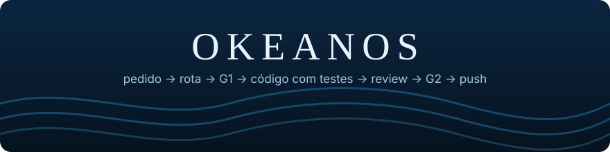
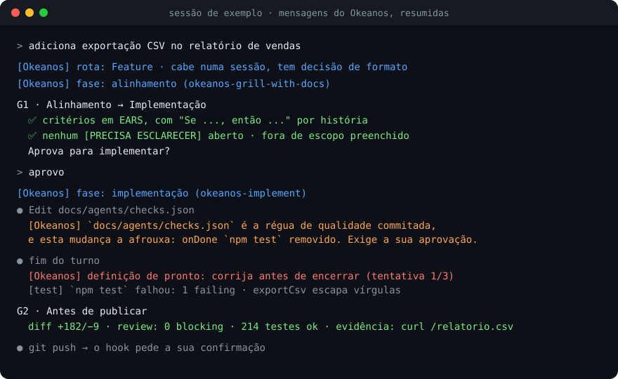

<p align="center">
  
</p>

<p align="center">
  <a href="LICENSE"></a>
  <a href=".claude-plugin/plugin.json"></a>
  
</p>

<h3 align="center">Um processo de engenharia para o seu agente de código. Do pedido ao push, sem atalhos.</h3>

<p align="center">
  
</p>

O Okeanos roda dentro do agente que você já usa. Ele classifica cada pedido numa rota, chama as skills certas sozinho e para em dois gates para você aprovar. Hooks determinísticos garantem as regras que não podem depender do modelo lembrar.

- **Rotas, não improviso**: Direto, Bug, Feature, Feature grande, Épico ou Triagem. Cada uma tem o seu fluxo.
- **Dois gates**: G1 antes de escrever código, G2 antes de publicar. Você aprova; o agente não contorna.
- **Pronto é pronto**: o turno só termina com typecheck, testes e build passando.
- **Testes são o contrato**: mudar ou desligar um teste já commitado exige a sua aprovação.
- **Proteções**: pacotes alucinados, segredos no commit, force push, `--no-verify` e a régua de qualidade afrouxada são barrados.
- **Qualquer agente, qualquer linguagem**: Claude Code, Codex, Copilot e Cursor, com um núcleo só.

## Como funciona

```
        pedido
          │  [Okeanos] rota: Feature
          ▼
   ┌──────────────────────────────────────────────────────┐
   │  alinhamento → G1 → implementação com TDD → review   │
   │  hooks: testes protegidos · pronto = checks verdes   │
   └──────────────────────────────────────────────────────┘
          │  G2: diff, review, testes, evidência
          ▼
        push, com a sua confirmação
```

Pedido trivial não passa por gate. Feature grande vira spec e tickets, que rodam na sessão, em subagentes paralelos ou em sandboxes Docker enquanto você está fora. Escreva "sem okeanos" para tratar um pedido sem o processo.

## Instalação

**Claude Code**

```sh
claude plugin marketplace add mateusblm/okeanos-agent
claude plugin install okeanos@okeanos
```

**Codex, Copilot e Cursor** (também instala no Claude Code, se estiver no PATH)

```sh
curl -fsSL https://raw.githubusercontent.com/mateusblm/okeanos-agent/main/install.sh | sh
```

Precisa de `git` e `python3`. Detalhes de cada agente, atualização e remoção: [docs/agentes.md](docs/agentes.md).

## Início rápido

```sh
$ cd meu-projeto
$ claude            # ou codex, copilot, cursor

> adiciona paginação na listagem de pedidos
[Okeanos] rota: Feature · cabe numa sessão
[Okeanos] fase: alinhamento (okeanos-grill-with-docs)
  ...perguntas curtas, depois o G1 para você aprovar

> aprovo
[Okeanos] fase: implementação (okeanos-implement)
  ...testes primeiro, review em dois eixos, depois o G2
```

Na primeira sessão num projeto, o `okeanos-onboard` lê o código, propõe um arquivo de contexto curto e grava em `docs/agents/checks.json` os comandos que definem "pronto". Quando o agente não pode pedir confirmação, ele bloqueia e diz o que rodar no seu terminal:

```sh
okeanos aprovar tests/test_pedidos.py   # mudar um teste já commitado
okeanos aprovar push                    # push, PR ou merge na branch principal
```

## Documentação

- [Guia](docs/guia.md): rotas e gates, aprovações, hooks, configuração e a lista de skills.
- [Proteções](docs/protecoes.md): como as aprovações, os hooks, os git hooks e o CI funcionam.
- [Agentes](docs/agentes.md): instalação e suporte em cada agente.
- [Arquitetura](docs/architecture.md): arc42 com diagramas C4.
- [Manutenção](docs/manutencao.md): como medir as etapas e removê-las conforme os modelos melhoram.

## Desenvolvimento

```sh
python3 -m pytest -q             # testes do motor, dialetos, instalador, git hooks e build
python3 scripts/build.py         # gera os arquivos do processo a partir de core/process.md
python3 scripts/build.py --check # falha se os gerados estiverem desatualizados
bin/okeanos install --dry-run    # instala a partir do clone local, sem aplicar
```

O processo vive em [`core/process.md`](core/process.md), as skills em [`skills/`](skills/) e o motor dos hooks em [`hooks/okeanos_engine/`](hooks/okeanos_engine/). O próprio repositório usa o Okeanos.

## Licença

MIT. Partes derivadas de outros projetos MIT estão creditadas no [`LICENSE`](LICENSE) e nos `CREDITS.md` das skills.

O nome vem do Okeanos da mitologia grega, o rio que dá a volta no mundo.
