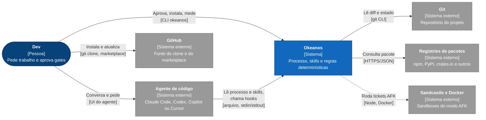
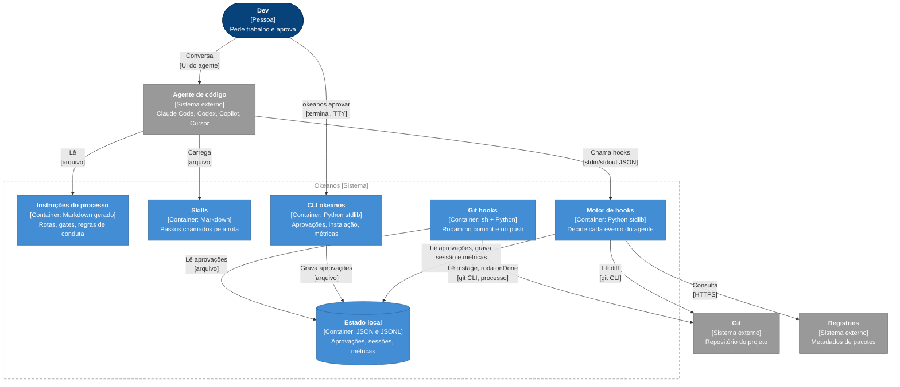
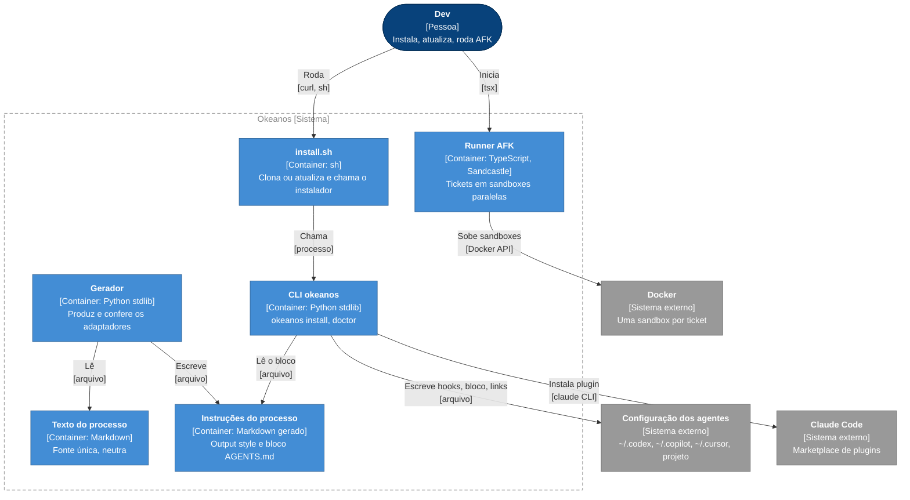
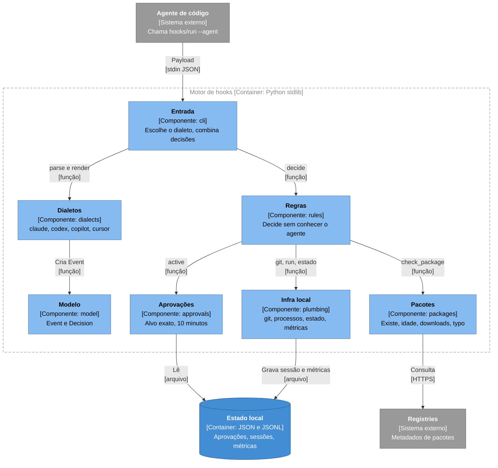
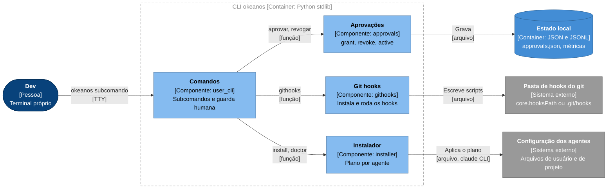
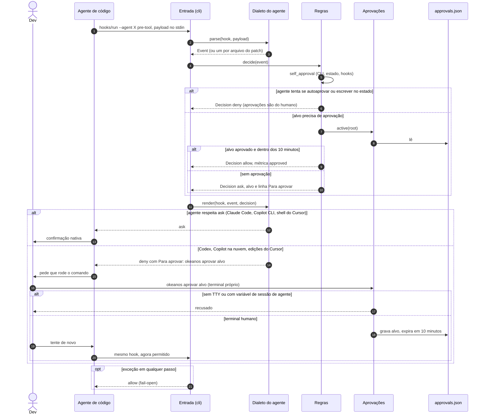
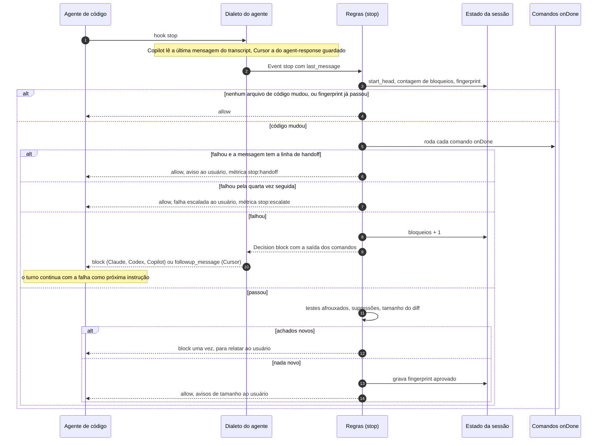
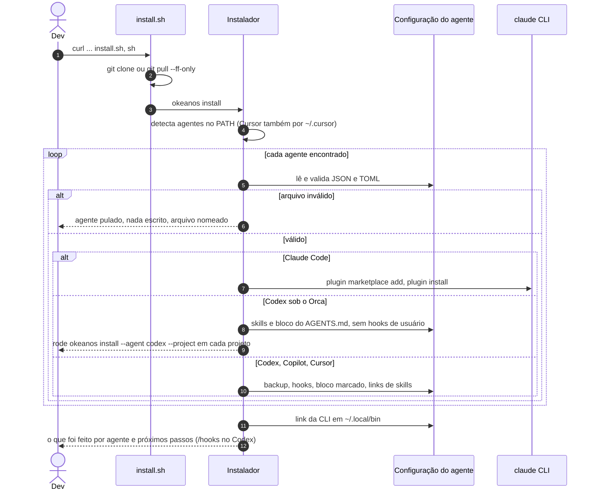
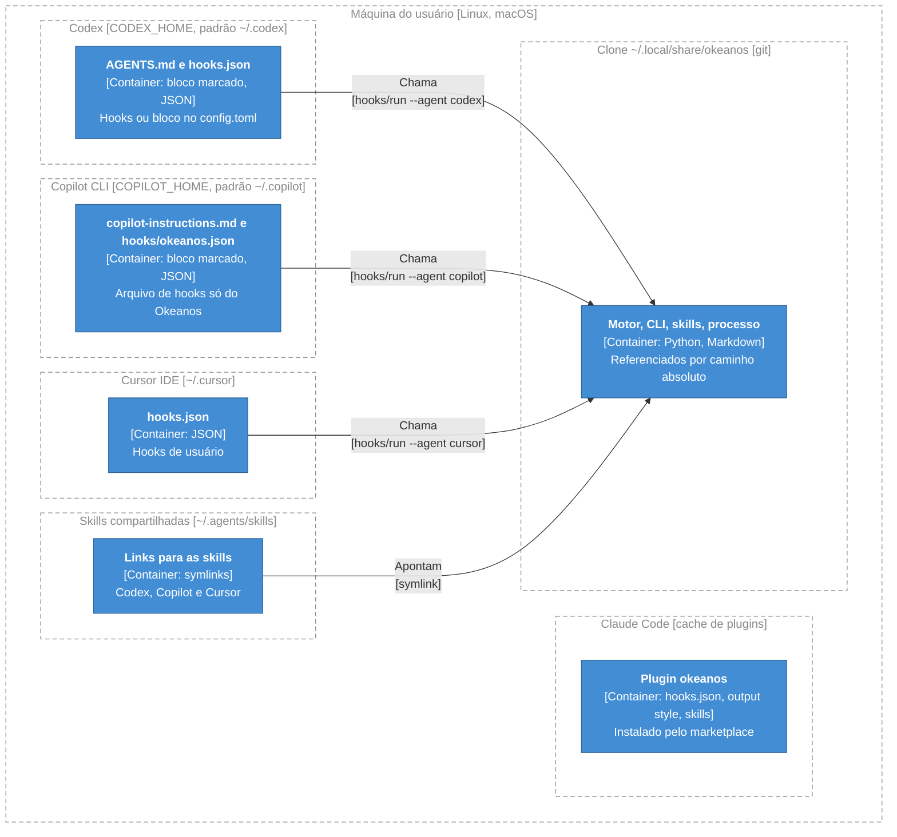
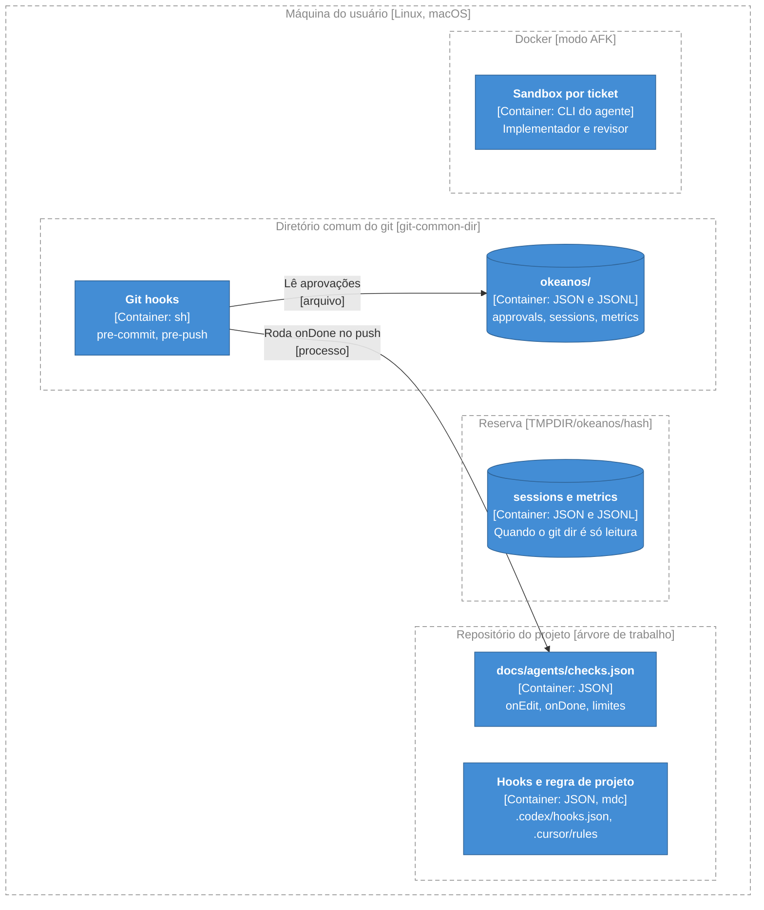

# Arquitetura do Okeanos

> Documento vivo no padrão arc42, com diagramas C4. Atualizado a cada entrega pelo as-built.
> Última atualização: portabilidade (2026-10-09).

## 1. Introdução e objetivos

### Visão geral dos requisitos

O Okeanos conduz cada sessão de um agente de código por um processo de engenharia. São três partes, um núcleo só para quatro agentes (Claude Code, Codex, GitHub Copilot CLI e Cursor IDE):

- **Processo**: o texto que classifica cada pedido numa rota (Direto, Bug, Feature, Feature grande, Épico, Triagem) e define dois gates de aprovação (G1 antes do código de produção, G2 antes de publicar).
- **Skills**: instruções em Markdown que o agente chama conforme a rota (`grill-with-docs`, `to-spec`, `implement`, `code-review`, `as-built` e outras).
- **Motor de hooks**: regras determinísticas em Python que o agente não pode esquecer: teste commitado protegido, definição de pronto, pacotes alucinados, segredos no commit, publicação só com aprovação humana.

Em volta disso: a CLI do usuário (`okeanos`), com as aprovações e o instalador; os git hooks por projeto; e o runner do modo AFK, que executa tickets em sandboxes Docker.

Features entregues:

- [Portabilidade para Codex, Copilot e Cursor](features/portabilidade.md): núcleo neutro, motor com dialetos, CLI `okeanos` com aprovações, instalador único, git hooks, AFK com agente configurável.

### Metas de qualidade

| Meta | Motivo |
| :- | :- |
| Segurança contra o próprio agente | As regras existem porque o modelo pode afrouxar um teste ou se autoaprovar. A aprovação é do humano e o agente não pode fabricá-la. |
| Nunca travar o trabalho | Hook quebrado bloquearia toda sessão. Qualquer erro interno vira "permitir" (fail-open). |
| Uma fonte para quatro agentes | Corrigir uma regra ou um passo do processo num lugar só; agentes diferem só no adaptador. |
| Instalação reversível | O instalador mexe em configuração do usuário: só no que é do Okeanos, com backup e desinstalação. |
| Zero dependências | Os hooks rodam em qualquer máquina com `python3`, sem `pip install`. |

### Stakeholders

| Papel | Expectativa |
| :- | :- |
| Dev que usa um agente | Mesmo processo e mesmas proteções em qualquer agente; aprovar com um comando curto; nada travado por erro do Okeanos. |
| Agente de código | Mensagens claras do porquê de cada bloqueio e de como seguir (`Para aprovar: okeanos aprovar <alvo>`, linha de handoff). |
| Mantenedor do Okeanos | Mudar processo, regra ou skill num lugar só; testes que pegam regressão por agente; gerados que acusam quando ficaram velhos. |

## 2. Restrições

- **Python 3, só biblioteca padrão**, para o motor, a CLI, o instalador e o gerador. `tomllib` (Python 3.11+) só é exigido para escrever hooks do Codex no `config.toml`.
- **Shell POSIX** nos pontos de entrada (`hooks/run`, `install.sh`, os git hooks). Sem `python3`, os hooks saem com 0 e o processo continua sem eles.
- **Formato de hook ditado por cada agente**: nomes de evento, campos do payload, saída aceita e suporte (ou não) a "perguntar" vêm da documentação de cada fornecedor e mudam sem aviso. Por isso o formato fica isolado num dialeto por agente.
- **Plugin do Claude Code** distribuído pelo marketplace (`.claude-plugin/`), com a lista de skills em `plugin.json`.
- **Arquivos gerados nunca se editam à mão**: `output-styles/okeanos.md` e `adapters/agents-md/okeanos.md` saem de `core/process.md` por `scripts/build.py`.
- **Skills neutras**: nada de nome de ferramenta exclusiva de um agente (conferido por `tests/test_skills_neutral.py`).
- **AFK**: Node, Docker e o Sandcastle; a credencial do agente das sandboxes é colada pelo humano em `.sandcastle/.env`.
- **Idioma**: mensagens ao usuário e ao agente em português; código e comentários em inglês.

## 3. Contexto e escopo

### Contexto de negócio

Legenda: azul-escuro = pessoa · azul = sistema · cinza = sistema externo

| Parceiro | O que troca com o sistema |
| :- | :- |
| Dev | Pedidos ao agente; aprovações (`okeanos aprovar`), instalação (`okeanos install`), diagnóstico (`okeanos doctor`), métricas (`okeanos metrics`). |
| Agente de código | Lê o processo (output style ou bloco de instruções) e as skills; chama os hooks a cada evento e recebe uma decisão. |
| Git | O motor lê `HEAD`, diffs e o diretório comum do git; guarda estado em `<git-common-dir>/okeanos/`; os git hooks rodam no commit e no push. |
| Registries de pacotes | Existência, idade e downloads de um pacote antes da instalação. Sem rede, a checagem não bloqueia. |
| GitHub | Fonte do clone (`install.sh`) e do marketplace do Claude Code. |
| Sandcastle e Docker | O runner AFK sobe uma sandbox por ticket, com o agente configurado. |

### Contexto técnico

| Parceiro | Canal |
| :- | :- |
| Agente → processo | Arquivo de instruções: output style do plugin (Claude Code), bloco marcado no `AGENTS.md` global (Codex), `copilot-instructions.md` (Copilot), regra `.cursor/rules/okeanos.mdc` por projeto (Cursor). |
| Agente → skills | Pasta de skills: plugin (Claude Code) ou links em `~/.agents/skills` (Codex, Copilot, Cursor). |
| Agente → motor | Processo filho: `hooks/run --agent <agente> <hook>`, payload JSON no stdin, resposta JSON no stdout com código de saída 0. |
| Dev → CLI | `okeanos <subcomando>` num terminal; `aprovar` e `revogar` exigem TTY e recusam em shell de agente. |
| Motor → git | `git` como processo filho (`rev-parse`, `diff`, `ls-files`). |
| Motor → registries | HTTPS com timeout de 4 s, só biblioteca padrão. |
| Git → git hooks | `pre-commit` e `pre-push` em sh, que chamam `bin/okeanos githook <nome>`. |

## 4. Estratégia de solução

- **Núcleo neutro e adaptadores finos.** O texto do processo vive em `core/process.md`, sem nomes de ferramenta. Um gerador produz o output style do Claude Code e o bloco de instruções dos outros agentes; `--check` falha se um gerado ficou para trás. As skills são as mesmas para todos.
- **Motor com dialetos.** Um evento normalizado (`Event`) e uma decisão normalizada (`Decision`) separam as regras do formato de cada agente. O dialeto traduz o payload para `Event` e a `Decision` para a saída do agente; as regras não sabem quem chamou. Suportar outro agente é escrever um dialeto e um plano no instalador.
- **Perguntar onde dá, negar e indicar onde não dá.** Claude Code, Copilot CLI e o shell do Cursor mostram a confirmação nativa. Codex, Copilot na nuvem e as edições do Cursor não respeitam "ask": o dialeto nega e mantém a última linha `Para aprovar: okeanos aprovar <alvo>`, um comando que só o humano roda.
- **Aprovação fora do alcance do agente.** As aprovações ficam em `<git-common-dir>/okeanos/approvals.json`, escritas só pela CLI humana (TTY, sem variável de sessão de agente). As regras negam ao agente rodar a CLI por qualquer atalho conhecido e escrever no estado do Okeanos ou nos hooks.
- **Fail-open.** Payload ilegível, agente desconhecido ou exceção numa regra viram "permitir". As barreiras seguintes (stop, git hooks, CI) cobrem o que escapar.
- **Instalação por plano.** O instalador monta uma lista de ações por agente, valida todo JSON e TOML antes de escrever, só toca blocos marcados e handlers próprios, e guarda backup.

## 5. Visão de blocos de construção

### Nível 1: containers

Em sessão, com o agente trabalhando:

Legenda: azul-escuro = pessoa · azul = container · cinza = sistema externo · tracejado = fronteira

Distribuição, instalação e AFK:

Legenda: azul-escuro = pessoa · azul = container · cinza = sistema externo · tracejado = fronteira

| Container | Responsabilidade | Tecnologia |
| :- | :- | :- |
| Texto do processo (`core/process.md`) | Rotas, gates, regras de conduta, neutro em relação ao agente. | Markdown |
| Gerador (`scripts/build.py`) | Gera o output style do Claude Code (com frontmatter) e o bloco marcado dos outros agentes; `--check` falha se algum estiver desatualizado. | Python stdlib |
| Instruções do processo (`output-styles/okeanos.md`, `adapters/agents-md/okeanos.md`) | O que o agente lê em cada sessão. | Markdown gerado |
| Skills (`skills/`) | Passos do processo; neutras, listadas em `.claude-plugin/plugin.json`. | Markdown (`SKILL.md`) |
| Motor de hooks (`hooks/run`, `hooks/okeanos.py`, `hooks/okeanos_engine/`) | Recebe cada evento do agente e devolve a decisão no formato dele. | Python stdlib, sh |
| CLI okeanos (`bin/okeanos`) | `aprovar`, `aprovacoes`, `revogar`, `metrics`, `githooks`, `doctor`, `install`. | Python stdlib |
| install.sh | Clona em `~/.local/share/okeanos` (ou faz `git pull --ff-only`) e roda `okeanos install`. | sh |
| Git hooks | `pre-commit` (segredos, testes afrouxados) e `pre-push` (comandos `onDone`), encadeando hooks anteriores. | sh que chama a CLI |
| Estado local | `approvals.json`, `sessions/*.json`, `metrics.jsonl` em `<git-common-dir>/okeanos/`, com reserva em `<TMPDIR>/okeanos/<hash>/`. | JSON, JSONL |
| Runner AFK (`skills/engineering/afk/scaffold/`) | Implementador e revisor por ticket, branch de integração, agente configurável (`AGENT`). | TypeScript, Sandcastle, Docker |

### Nível 2: componentes do motor de hooks

Legenda: azul = container · azul-claro = componente · cinza = sistema externo · tracejado = fronteira

| Componente | Responsabilidade | Interface pública |
| :- | :- | :- |
| Entrada (`okeanos.py`, `cli.py`) | Lê `--agent` e o hook, decodifica o stdin, decide cada `Event` e combina as decisões de um patch com vários arquivos (deny vence; asks viram um só, com uma linha `Para aprovar`). Qualquer exceção vira "permitir". `OKEANOS_HOOK_DEBUG` registra os payloads. | `main(argv)`, `handle(dialect, hook, data)`, `combine(decisions)`, `metrics_summary(days)` |
| Dialetos (`dialects/`) | Um módulo por agente: payload do agente para `Event` (ou lista, ou `None`), `Decision` para stdout e código de saída. Nunca decidem nada. | `NAME`, `parse(hook, data)`, `render(hook, event, decision)`; registro em `DIALECTS` |
| Modelo (`model.py`) | O contrato: tipos de evento (`session_start`, `prompt`, `pre_tool`, `post_tool`, `stop`), tipos de ferramenta e ações (`allow`, `ask`, `deny`, `block`). | `Event`, `Decision` |
| Regras (`rules.py`) | Publicação (G2), git e `rm` perigosos, segredos, pacotes, testes commitados (editor e shell), autoaprovação, `onEdit`, definição de pronto, adulteração de testes, supressões, tamanho, lembrete de rota. | `decide(event, ctx)`; detectores reusados pelos git hooks |
| Aprovações (`approvals.py`) | Lê e grava `approvals.json` só no diretório do git; expira em 10 minutos; `OKEANOS_NOW` fixa o relógio nos testes. | `active`, `is_approved`, `grant`, `revoke`, `how_to` |
| Pacotes (`packages.py`) | Extrai pedidos de instalação de npm, pip, cargo, gem, composer, dotnet e go; consulta o registry; compara com nomes populares. | `package_requests(toks)`, `check_package(eco, name)` |
| Infra local (`plumbing.py`) | Processos com timeout, git, `checks.json`, estado por sessão e o log de métricas, com reserva em TMPDIR. | `run`, `git`, `repo_root`, `okeanos_dir`, `fallback_dir`, `state_path`, `Context.log` |

Os dialetos, por agente:

| Dialeto | Hooks atendidos | "Perguntar" | Fim do turno |
| :- | :- | :- | :- |
| `claude` | `session-start`, `prompt`, `pre-bash`, `pre-edit`, `post-edit`, `stop` | nativo | `decision: block` |
| `codex` | `session-start`, `prompt`, `pre-tool` (Bash, `apply_patch`), `post-tool`, `stop` | vira deny com `Para aprovar` | `decision: block`, o turno continua |
| `copilot` | `session-start` (que também gera o lembrete de rota), `pre-tool`, `post-tool`, `stop`; dois formatos de payload (camelCase e o compatível com VS Code) | nativo no CLI; deny com `COPILOT_AGENT_PROMPT` (nuvem) ou `COPILOT_ALLOW_ALL` | `decision: block`; a última mensagem vem do transcript |
| `cursor` | `session-start`, `shell`, `pre-tool`, `post-tool`, `agent-response`, `stop` | nativo no shell; deny nas edições | `followup_message`; a última mensagem vem do `agent-response` guardado em `sessions/` |

### Nível 2: componentes da CLI okeanos

Legenda: azul-escuro = pessoa · azul = container · azul-claro = componente · cinza = sistema externo · tracejado = fronteira

| Componente | Responsabilidade | Interface pública |
| :- | :- | :- |
| Comandos (`user_cli.py`) | Parser dos subcomandos; `aprovar` e `revogar` recusam sem TTY e com variável de sessão de agente (`AGENT_SESSION_VARS`); normaliza o alvo (caminho relativo ao repo, `push`, `pacote:<nome>`); `doctor` mostra instalação, Orca e hooks de projeto. | `okeanos aprovar`, `aprovacoes`, `revogar`, `metrics`, `githooks`, `githook` (interno), `install`, `doctor` |
| Aprovações (`approvals.py`) | O mesmo componente do motor; aqui, o único que grava. Escrita atômica (arquivo temporário e `os.replace`). | `grant(root, targets)`, `revoke(root, target)` |
| Git hooks (`githooks.py`) | Escreve `pre-commit` e `pre-push` marcados com `# okeanos-githook`, guarda o anterior como `<nome>.okeanos-prev` e o roda antes; o sh só falha com o código 3. Detectores vêm de `rules.py`. | `install(root, cli)`, `uninstall(root)`, `run_hook(name)` |
| Instalador (`installer.py`) | Um plano (`Write`, `Link`, `Remove`, `Run`) por agente; valida JSON e TOML antes de escrever; backup `<arquivo>.okeanos-bak`; skills compartilhadas em `~/.agents/skills`; `--project` para Codex e Cursor; Codex sob o Orca recebe hooks só por projeto. | `run(agents, uninstall, dry_run, project, codex_hooks)`, `status()` |

## 6. Visão de tempo de execução

### Decisão antes de uma ferramenta, com aprovação

O agente quer rodar um comando ou editar um arquivo que exige aprovação (aqui, mudar um teste commitado). Onde o agente sabe perguntar, a confirmação é nativa; onde não sabe, o Okeanos nega e indica o comando que só o humano roda.

Negações duras (segredo, force push, `--no-verify`, `rm -r` fora do repo, pacote inexistente) saem antes da consulta às aprovações e não são aprováveis.

### Fim do turno e definição de pronto

Nos agentes sem canal de mensagem só para o usuário (Copilot e Cursor), o aviso de escalada e o de handoff aparecem só em `okeanos metrics`.

### Instalação

## 7. Visão de implantação

Tudo roda na máquina do usuário. Não há servidor.

Legenda: azul = container · tracejado = fronteira (nó de implantação)

Por repositório:

Legenda: azul = container · tracejado = fronteira (nó de implantação)

| Agente | Onde o processo entra | Onde os hooks ficam | Execução real |
| :- | :- | :- | :- |
| Claude Code | output style do plugin | `hooks/hooks.json` do plugin | sim, uso diário |
| Codex | bloco no `AGENTS.md` de `CODEX_HOME` | `~/.codex/hooks.json` ou `[hooks]` no `config.toml`; sob o Orca, `<repo>/.codex/hooks.json` (`--project`), porque o Orca regenera `CODEX_HOME` a cada partida | sim, sessões reais no Codex 0.161 e sob o Orca |
| Copilot CLI | bloco no `~/.copilot/copilot-instructions.md` | `~/.copilot/hooks/okeanos.json` | não: só testes com payloads da documentação |
| Cursor IDE | regra por projeto `.cursor/rules/okeanos.mdc` (`--project`) | `~/.cursor/hooks.json` | não: só testes com payloads da documentação e de relatos |

**Estado e reserva.** O estado vive em `<git-common-dir>/okeanos/`, compartilhado entre worktrees do mesmo repositório. Quando esse diretório não aceita escrita (a sandbox `workspace-write` do Codex), sessões e métricas caem em `<TMPDIR>/okeanos/<hash do git dir>/`. As aprovações nunca caem na reserva: são lidas só do diretório do git, onde o humano as grava.

**Build e release.** Não há pipeline de release no repo. A versão do plugin está em `.claude-plugin/plugin.json`; os gerados são conferidos pela checagem `build` de `docs/agents/checks.json`, que também valida os manifestos e roda os testes. Atualizar é `install.sh` de novo (clone com `git pull --ff-only` e reinstalação idempotente) ou `claude plugin update` no Claude Code.

## 8. Conceitos transversais

**Fail-open.** `hooks/run` sai com 0 sem `python3`; `okeanos.py` sai com 0 se o import falha; `cli.handle` transforma qualquer exceção do dialeto ou das regras em "permitir" e, se até o render falhar, devolve saída vazia. Os git hooks só falham com o código 3; qualquer outro erro passa com aviso. A única exceção deliberada é o Cursor: hooks de permissão sempre imprimem JSON, porque o Cursor bloqueia saída que não parseia.

**Aprovações e autoaprovação.** A ameaça principal é o agente se autoaprovar. Três camadas: a CLI exige TTY e recusa com `CLAUDECODE`, `CODEX_*` ou `CURSOR_AGENT` no ambiente; as regras (`self_approval`) negam rodar `aprovar`, `revogar` ou `install --uninstall`, inclusive por interpretador, runner, pseudo-terminal ou com as variáveis de agente removidas, e negam escrever no estado do Okeanos, na reserva, nos git hooks ou nos hooks de projeto com entradas do Okeanos; e a aprovação vale para um alvo exato por 10 minutos.

**Validação de entrada.** Cada dialeto trata payload malformado como "nada a checar" (`None`). O que o dialeto não sabe ler numa edição conta como reescrita do arquivo inteiro, o caso mais conservador para a proteção de testes. O instalador valida todo arquivo de configuração antes de escrever.

**Mensagens.** Todo `ask` termina com `Para aprovar: okeanos aprovar <alvo>`. Mensagens de segredo citam arquivo e tipo, nunca o valor. Avisos só para o usuário (`Decision.message`) caem onde o agente não tem esse canal; ficam nas métricas.

**Métricas.** Cada deny, ask, aprovação usada, bloqueio e falha vira uma linha JSON (`ts`, `agent`, `session`, `branch`, `kind`, `detail`) em `metrics.jsonl`. `okeanos metrics` soma o arquivo do git dir e o da reserva, por tipo e por agente; a skill `retro` usa esse resumo.

**Configuração.** Por projeto, `docs/agents/checks.json` (criado pela skill `onboard`). Por máquina, variáveis: `CODEX_HOME`, `COPILOT_HOME`, `OKEANOS_REPO`, `OKEANOS_DIR`, e para testes `OKEANOS_HOME_DIR` (troca o HOME, inclusive dos CLIs de agente) e `OKEANOS_NOW` (relógio). `OKEANOS_HOOK_DEBUG` registra payloads crus.

**Edição só do que é do Okeanos.** Blocos entre `<!-- okeanos:start -->` e `<!-- okeanos:end -->` (Markdown) ou `# okeanos:start` e `# okeanos:end` (TOML), handlers cujo comando roda `hooks/run` ou `onboard-check.sh` com `--agent <agente>`, links que apontam para o clone, git hooks com `# okeanos-githook`. Backup `<arquivo>.okeanos-bak` antes de mudar.

**Testes.** `python3 -m pytest -q` na raiz. Os testes do motor entregam o payload no formato documentado de cada agente ao CLI do motor e conferem a saída no formato do agente (`test_engine_<agente>.py`); o instalador roda contra um HOME temporário (`test_installer.py`); os git hooks fazem commit e push de verdade em repositórios temporários (`test_githooks.py`); `test_build.py` confere o gerador e `test_skills_neutral.py` a neutralidade das skills. Ver §10.

## 9. Decisões de arquitetura

Não há ADRs em `docs/adr/`. Decisões relevantes, todas sem ADR:

- **Núcleo neutro com adaptadores gerados** em vez de um plugin por agente (sem ADR). Motivo: manutenção multiplicada por quatro.
- **Evento e decisão normalizados, um dialeto por agente** (sem ADR). As regras nunca veem payload de agente; os dialetos nunca decidem.
- **"Perguntar" vira "negar" com `okeanos aprovar` onde o agente não respeita ask** (sem ADR): Codex, Copilot na nuvem ou com `COPILOT_ALLOW_ALL`, edições do Cursor.
- **Aprovações só no diretório do git, gravadas só pela CLI humana** (sem ADR). A reserva em TMPDIR vale para sessões e métricas, não para aprovações.
- **Reserva em TMPDIR quando o git dir é só leitura** (sem ADR), para a definição de pronto funcionar dentro da sandbox do Codex.
- **Codex sob o Orca recebe hooks por projeto** (sem ADR): o Orca regenera `hooks.json` e `config.toml` do `CODEX_HOME` a cada partida (conferido ao vivo em 2026-10-09).
- **Skills compartilhadas em `~/.agents/skills`** para Codex, Copilot e Cursor, com contagem de usuários na desinstalação (sem ADR).
- **Claude Code instalado pelo próprio marketplace** (sem ADR); o instalador nunca toca nas configurações do Claude.
- **Só biblioteca padrão do Python** (sem ADR).

## 10. Requisitos de qualidade

| Meta | Estímulo | Resposta esperada |
| :- | :- | :- |
| Segurança contra o agente | O agente roda `okeanos aprovar push` no shell dele, direto, por `python -c`, por `script` ou com `env -u CODEX_THREAD_ID`. | O hook nega; se o comando chegasse a rodar, a CLI recusa sem TTY ou com variável de sessão de agente. |
| Segurança contra o agente | O agente escreve em `.git/okeanos/approvals.json` ou em `<TMPDIR>/okeanos/`. | O hook nega. |
| Segurança contra o agente | O agente edita uma asserção de teste commitado no Codex. | Deny com `Para aprovar: okeanos aprovar <arquivo>`; depois de `okeanos aprovar` no terminal humano, a mesma edição passa por 10 minutos. |
| Nunca travar | Payload malformado, agente desconhecido ou exceção numa regra. | Saída "permitir", código 0. |
| Definição de pronto | O agente encerra com `onDone` falhando, em qualquer dos quatro agentes. | Bloqueio (ou `followup_message` no Cursor) até 3 vezes; na quarta, escala ao usuário. Com a linha de handoff, libera e avisa. |
| Uma fonte | `core/process.md` muda e os gerados não são regerados. | `python3 scripts/build.py --check` falha e lista os desatualizados. |
| Instalação reversível | `~/.codex/hooks.json` existente não é JSON válido. | Codex pulado sem escrita, arquivo nomeado; os outros agentes seguem. |
| Instalação reversível | `okeanos install` roda duas vezes. | Mesmo estado de uma instalação só. |
| Paridade | O Claude Code chama os hooks com os payloads de antes da reorganização. | Mesmas respostas (`tests/test_engine_claude.py`). |

## 11. Riscos e débitos técnicos

| Item | Tipo | Impacto | Origem |
| :- | :- | :- | :- |
| Autoaprovação residual no Codex e no Cursor: lá quem aprova é `okeanos aprovar`, e um agente rodando como o mesmo usuário do sistema poderia escrever um programa novo que contorne as checagens de `self_approval` (que reconhecem atalhos conhecidos, não toda forma de escrever no arquivo). | risco | Alto: a aprovação de teste ou de push vira fraca nesses agentes. Barreiras seguintes: stop, git hooks, CI. | [portabilidade](features/portabilidade.md), README (Aprovações) |
| Copilot não põe variável de sessão no shell das ferramentas: a recusa de `okeanos aprovar` ali depende só do TTY e dos hooks. | risco | Médio. | portabilidade |
| `CURSOR_AGENT` não é documentada oficialmente; se sumir, a CLI perde um dos sinais de shell de agente. | risco | Médio: sobra o TTY e os hooks. | portabilidade |
| Copilot e Cursor nunca rodaram uma sessão real com o Okeanos; os dialetos foram testados com payloads montados da documentação. | risco | Alto: um formato diferente faz o dialeto devolver `None` e tudo passa (fail-open). | portabilidade |
| Formatos não documentados: argumentos das ferramentas de edição do Copilot, transcript do Copilot (última mensagem no `agentStop`), `tool_input` do Cursor (`StrReplace`, `path` ou `file_path`). | risco | Médio: handoff não detectado, ou edição tratada como reescrita total. | portabilidade |
| Codex só passa `apply_patch` pelo `PostToolUse`: escritas pelo shell não rodam `onEdit`. | débito | Baixo: o stop ainda roda `onDone`. | portabilidade |
| Codex exige `/hooks` para confiar nos hooks depois de instalar e de cada atualização; até lá, nenhuma proteção roda. | risco | Médio. | portabilidade |
| Sob o Orca, cada projeto precisa de `okeanos install --agent codex --project`; projeto esquecido roda sem hooks. Hooks de usuário e de projeto juntos rodariam duas vezes (o instalador avisa). | risco | Médio. | portabilidade |
| Reserva em TMPDIR some no reboot: métricas e estado de sessão podem ficar curtos. | débito | Baixo: a `retro` avisa quando as contagens parecem curtas. | portabilidade |
| Hooks de usuário do Copilot não valem na nuvem, que só lê `.github/hooks/` do repositório; o instalador não escreve lá. | débito | Médio na nuvem. | portabilidade |
| Avisos só para o usuário (escalada, handoff, tamanho) não aparecem no Copilot e no Cursor. | débito | Baixo: ficam em `okeanos metrics`. | portabilidade |
| O Codex ignora `disable-model-invocation`: skills manuais podem ser escolhidas sozinhas. | débito | Baixo. | portabilidade |
| Git hooks guardam o caminho absoluto da CLI; mover o clone exige `okeanos githooks` de novo. `git commit --no-verify` pula os git hooks (escolha do humano). | débito | Baixo. | portabilidade |
| Checagem de pacotes precisa de rede; offline não bloqueia. | risco | Baixo. | anterior |
| Sem `python3`, hooks desligados em silêncio. | risco | Médio. | anterior |
| O passo do Claude Code no instalador roda o `claude` real; os testes o isolam com `OKEANOS_HOME_DIR`. O instalador nunca foi rodado de ponta a ponta no Copilot e no Cursor de verdade. | risco | Médio. | portabilidade |
| `core/process.md` cita só `.git/okeanos/metrics.jsonl` e não a reserva em TMPDIR. | débito | Baixo. | portabilidade |

## 12. Glossário

Não há `GLOSSARY.md`. Termos usados aqui:

| Termo | Significado |
| :- | :- |
| Rota | Classificação de um pedido (Direto, Bug, Feature, Feature grande, Épico, Triagem) que define o fluxo de skills. |
| G1, G2 | Gates de aprovação: G1 antes do código de produção, G2 antes de push, PR, merge ou deploy. |
| Definição de pronto | Os comandos `onDone` de `checks.json`, rodados no fim do turno quando o código mudou. |
| Linha de handoff | `**Okeanos** · precisa de você`: o agente declara que a correção depende do usuário, e o stop libera. |
| Dialeto | Módulo que traduz o formato de hook de um agente para `Event` e `Decision`. |
| Event, Decision | O contrato neutro entre dialetos e regras. |
| Alvo | O que uma aprovação libera: caminho de teste relativo ao repo, `push` ou `pacote:<nome>`. |
| Reserva | `<TMPDIR>/okeanos/<hash>/`, onde sessões e métricas vão quando o diretório do git é só leitura. |
| Adaptador | O que traduz o núcleo para um agente: arquivos gerados, dialeto e plano do instalador. |
| AFK | Execução dos tickets em sandboxes Docker enquanto o usuário está fora. |
