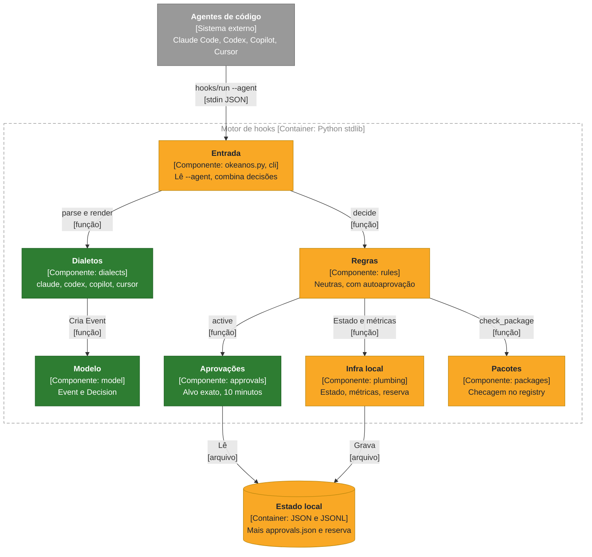
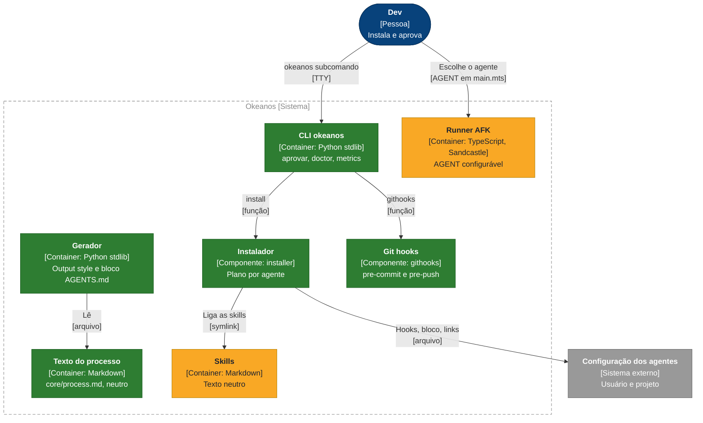
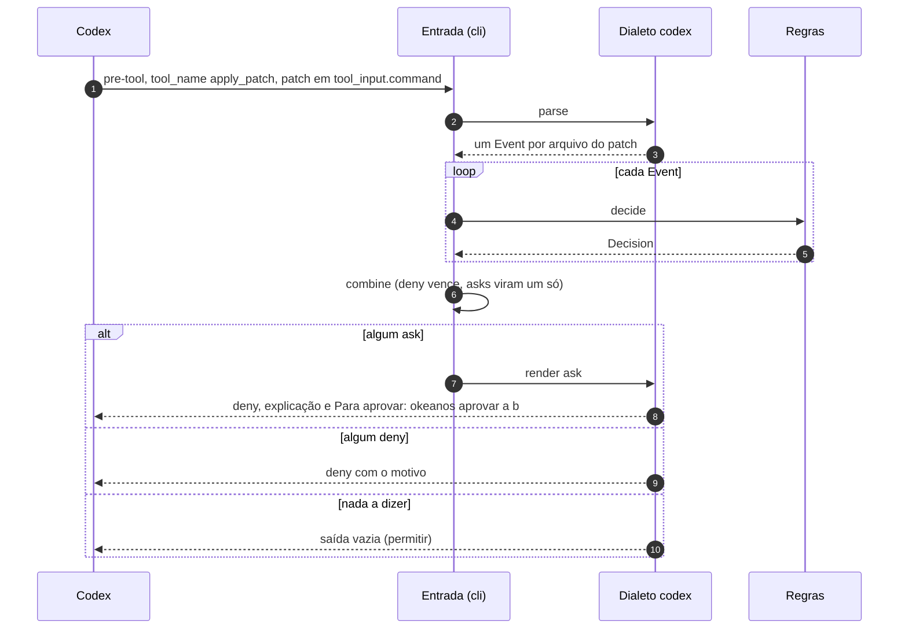
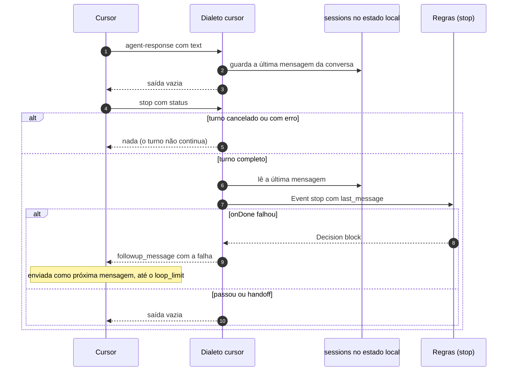
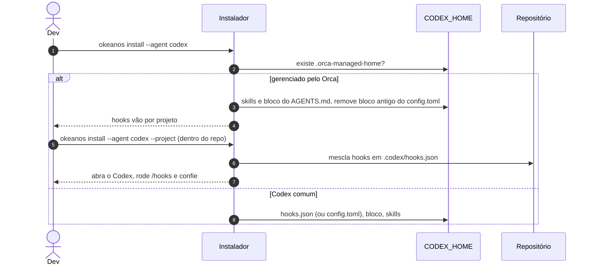

# Portabilidade para Codex, Copilot e Cursor

O Okeanos deixou de ser só um plugin do Claude Code. O mesmo processo, as mesmas skills e as mesmas proteções (teste commitado, definição de pronto, pacotes, segredos, publicação) agora valem no Codex, no GitHub Copilot CLI e no Cursor IDE, instalados por um comando só. Onde o agente não sabe pedir confirmação, o humano aprova com `okeanos aprovar <alvo>` no próprio terminal.

**Status:** entregue em `feat/portabilidade` · **Spec:** [.scratch/portabilidade/spec.md](../../.scratch/portabilidade/spec.md) (arquivada) · **ADRs:** nenhum

## O que foi construído

- **Núcleo neutro do processo.** `core/process.md` é a fonte; `scripts/build.py` gera o output style do Claude Code e o bloco `AGENTS.md` dos outros agentes, e `--check` (na definição de pronto do repo) falha se algum ficar desatualizado.
- **Skills neutras.** Chamadas viram ``use the `<nome>` skill``; ferramentas exclusivas viram capacidades ("a subagent", "ask the user"). `tests/test_skills_neutral.py` confere.
- **Motor com dialetos.** As regras saíram do `hooks/okeanos.py` monolítico para `okeanos_engine/rules.py`, que recebe um `Event` e devolve uma `Decision`. Quatro dialetos: `claude` (paridade com o comportamento anterior), `codex`, `copilot`, `cursor`. Cada métrica leva o nome do agente. Agente desconhecido ou payload ilegível: permitir.
- **CLI `okeanos`.** `aprovar`, `aprovacoes`, `revogar`, `metrics`, `githooks`, `doctor`, `install`. Aprovação por alvo exato (caminho de teste, `push`, `pacote:<nome>`), por 10 minutos, gravada em `<git-common-dir>/okeanos/approvals.json`. `aprovar` e `revogar` exigem TTY e recusam com variável de sessão de agente no ambiente.
- **Defesa contra autoaprovação.** As regras negam ao agente rodar a CLI humana (direto, por interpretador, runner, pseudo-terminal ou com o ambiente limpo), escrever no estado do Okeanos (inclusive na reserva em TMPDIR), mexer nos git hooks ou nos hooks de projeto do Okeanos e rodar `okeanos install --uninstall`.
- **Instalador único.** `install.sh` clona ou atualiza e roda `okeanos install`, que detecta os agentes, monta um plano por agente, valida JSON e TOML antes de escrever, faz backup, só toca o que é do Okeanos e desinstala. Claude Code pelo marketplace; Codex, Copilot e Cursor por arquivos, com skills compartilhadas em `~/.agents/skills`.
- **Git hooks.** `okeanos githooks` instala `pre-commit` (segredos, `.env`, testes commitados afrouxados sem aprovação) e `pre-push` (comandos `onDone`), encadeando hooks anteriores.
- **AFK multiagente.** `AGENT` em `.sandcastle/main.mts` escolhe Claude Code, Codex, Copilot ou Cursor; outro valor falha na partida com a lista.
- **README** com a instalação por agente e a tabela do que cada um suporta.

Desvios e acréscimos em relação à spec, e o motivo:

- **Cursor sem regra global.** A spec previa instalar as regras na configuração de usuário; o Cursor não tem arquivo para isso. `okeanos install --agent cursor --project` escreve `.cursor/rules/okeanos.mdc` por repositório.
- **Copilot sem hook `prompt`.** O Copilot descarta a saída de hooks em `userPromptSubmitted`; o lembrete de rota vai no `session-start`, que gera dois eventos.
- **Cursor guarda a última mensagem.** O `stop` do Cursor não traz a mensagem final; um hook a mais (`agent-response`) a guarda em `sessions/` para a detecção da linha de handoff.
- **Reserva em TMPDIR.** Não estava na spec. Na sandbox do Codex o diretório do git é só leitura; sessões e métricas caem em `<TMPDIR>/okeanos/<hash>/`. Aprovações não caem: continuam lidas só do diretório do git.
- **Codex sob o Orca.** Não estava na spec. O Orca regenera `CODEX_HOME` (com `hooks.json` e `config.toml`) a cada partida; o instalador não escreve hooks de usuário ali e os hooks vão por projeto (`okeanos install --agent codex --project`, em `.codex/hooks.json`).
- **`--codex-hooks toml`.** Opção para pôr os hooks do Codex em tabelas `[hooks]` no fim do `config.toml`, entre marcadores.
- **Checagem de sessão de agente na CLI**, além do TTY (`CLAUDECODE`, `CODEX_*`, `CURSOR_AGENT`), e o endurecimento de `self_approval` contra interpretadores, pseudo-terminais e ambiente limpo, porque o TTY sozinho é contornável (um pseudo-terminal o satisfaz).
- **Ponta a ponta.** O Codex rodou de verdade (formato dos hooks e variáveis do Codex 0.161, comportamento do Orca conferido em 2026-10-09). Copilot e Cursor, como a spec já previa, ficaram só com testes de dialeto.

## Onde se encaixa na arquitetura

Motor de hooks:

Legenda: azul = container · cinza = sistema externo · tracejado = fronteira · verde = novo · amarelo = alterado

Núcleo, CLI e distribuição:

Legenda: azul-escuro = pessoa · cinza = sistema externo · tracejado = fronteira · verde = novo · amarelo = alterado

## Como funciona

O fluxo de decisão com aprovação e o de definição de pronto estão em [architecture.md §6](../architecture.md#6-visão-de-tempo-de-execução). Abaixo, os fluxos que esta feature criou e que não existiam no Claude Code.

### Um patch do Codex com vários arquivos

O `apply_patch` do Codex chega num evento só, com o patch inteiro. O dialeto gera um `Event` por arquivo, e a entrada combina as decisões.

### Fim do turno no Cursor

O `stop` do Cursor não traz a última mensagem do agente, e o bloqueio vira uma nova mensagem do usuário.

### Codex sob o Orca

## Componentes

| Componente | Responsabilidade | Mudança |
| :- | :- | :- |
| `core/process.md` | Texto do processo neutro | novo (extraído do output style) |
| `scripts/build.py` | Gera e confere os adaptadores | novo |
| `output-styles/okeanos.md`, `adapters/agents-md/okeanos.md` | Instruções lidas pelos agentes | o primeiro passou a ser gerado; o segundo é novo |
| `skills/` | Passos do processo | alterado: redação neutra; `afk` com `AGENT` |
| `hooks/okeanos.py` | Ponto de entrada | alterado: de 900 linhas para um carregador da `cli` |
| `hooks/hooks.json` | Hooks do Claude Code | alterado: `--agent claude` |
| `hooks/onboard-check.sh` | Pede o `onboard` | alterado: `--agent`, `AGENTS.md` fora do Claude Code, formato de saída por agente |
| `okeanos_engine/model.py` | `Event` e `Decision` | novo |
| `okeanos_engine/cli.py` | Entrada do motor, `combine`, `metrics` | novo |
| `okeanos_engine/rules.py` | Regras neutras, `self_approval` | alterado: extraído e estendido |
| `okeanos_engine/plumbing.py` | git, processos, estado, métricas com agente, reserva em TMPDIR | alterado: extraído e estendido |
| `okeanos_engine/packages.py` | Checagem de pacotes | alterado: extraído; redirecionamentos do shell não são nomes de pacote |
| `okeanos_engine/approvals.py` | Aprovações | novo |
| `okeanos_engine/dialects/` | `claude`, `codex`, `copilot`, `cursor` | novo |
| `okeanos_engine/user_cli.py`, `bin/okeanos` | CLI do usuário | novo |
| `okeanos_engine/githooks.py` | Git hooks | novo |
| `okeanos_engine/installer.py`, `install.sh` | Instalador | novo |
| `skills/engineering/afk/scaffold/` | Runner AFK | alterado: fábrica por agente, Dockerfile com um bloco por CLI de agente |

## Dados

Estado local em `<git-common-dir>/okeanos/` (sem banco de dados):

| Arquivo | Conteúdo | Mudança |
| :- | :- | :- |
| `approvals.json` | `{alvo: {approved_at, expires_at}}`, escrito só pela CLI humana | novo |
| `metrics.jsonl` | uma linha por evento: `ts`, `agent`, `session`, `branch`, `kind`, `detail` | alterado: campo `agent` |
| `sessions/<id>.json` | `start_head`, bloqueios, fingerprints, lembrete de rota | inalterado |
| `sessions/<id>.cursor-last-response` | última mensagem do agente no Cursor | novo |

Sessões e métricas podem estar na reserva `<TMPDIR>/okeanos/<hash do git dir>/`; `okeanos metrics` soma os dois lugares.

## Testes

`python3 -m pytest -q` na raiz (593 testes). A seam principal é o CLI do motor: payload no formato documentado de cada agente na entrada, saída no formato daquele agente conferida, sem chamar funções internas.

| Arquivo | O que cobre |
| :- | :- |
| `tests/test_engine_claude.py` | paridade com o comportamento anterior do Claude Code, agente nas métricas, fail-open, autoaprovação |
| `tests/test_engine_codex.py`, `test_engine_copilot.py`, `test_engine_cursor.py` | a bateria de cenários (teste protegido por editor e shell, pronto, pacote inexistente, segredo, push, aprovação válida e expirada) em cada dialeto, mais as particularidades de cada um |
| `tests/test_cli.py` | `okeanos aprovar`, `revogar`, `aprovacoes`, recusa sem TTY e com variável de agente, `doctor` |
| `tests/test_installer.py` | instalação em HOME temporário (`OKEANOS_HOME_DIR`): idempotência, conteúdo do usuário preservado, JSON/TOML inválido, desinstalação, skills compartilhadas, `--project`, Orca |
| `tests/test_githooks.py` | commit e push reais em repositórios temporários, encadeamento, fail-open |
| `tests/test_state_fallback.py` | definição de pronto com diretório do git só leitura |
| `tests/test_build.py`, `tests/test_skills_neutral.py` | gerador e `--check`; skills sem nomes exclusivos |
| `tests/test_afk_runner.py` | `AGENT` inválido falha com a lista de suportados |

## Limites e próximos passos

- **Autoaprovação residual no Codex e no Cursor.** A aprovação é o `okeanos aprovar`, não uma confirmação do programa do agente. As checagens barram atalhos conhecidos e reward hacking acidental, mas um agente rodando como o mesmo usuário do sistema poderia escrever um programa novo que contorne essas checagens. Barreiras seguintes: stop, git hooks, CI.
- **Copilot e Cursor nunca rodaram de verdade.** Formatos inferidos: argumentos das ferramentas de edição e transcript do Copilot; `tool_input` do Cursor; `CURSOR_AGENT`. Um formato diferente vira "permitir" pelo fail-open.
- **Copilot sem variável de sessão** no shell das ferramentas: a recusa da CLI ali depende do TTY e dos hooks.
- **Copilot na nuvem** só lê `.github/hooks/` do repositório; o instalador não escreve lá.
- **Codex** exige `/hooks` depois de cada instalação e atualização; só `apply_patch` passa pelo `PostToolUse`; ignora `disable-model-invocation`.
- **Orca**: cada projeto precisa do `--project`; hooks de usuário e de projeto juntos rodariam duas vezes.
- **Reserva em TMPDIR** some no reboot.
- **Avisos só para o usuário** não aparecem no Copilot e no Cursor; ficam em `okeanos metrics`.
- **Fora de escopo**: Gemini CLI, opencode, hooks do Cursor CLI, plugins de marketplace nativos de Codex, Copilot e Cursor.

## Impacto na arquitetura

Primeira versão de [`docs/architecture.md`](../architecture.md), escrita nesta entrega: todas as seções. As que esta feature define:

- [§3 Contexto](../architecture.md#3-contexto-e-escopo): quatro agentes como sistema externo.
- [§5 Blocos de construção](../architecture.md#5-visão-de-blocos-de-construção): motor com dialetos, CLI, instalador, git hooks.
- [§6 Tempo de execução](../architecture.md#6-visão-de-tempo-de-execução): decisão com aprovação, definição de pronto, instalação.
- [§7 Implantação](../architecture.md#7-visão-de-implantação): onde cada agente recebe processo, skills e hooks; reserva em TMPDIR.
- [§9 Decisões](../architecture.md#9-decisões-de-arquitetura) e [§11 Riscos](../architecture.md#11-riscos-e-débitos-técnicos).
