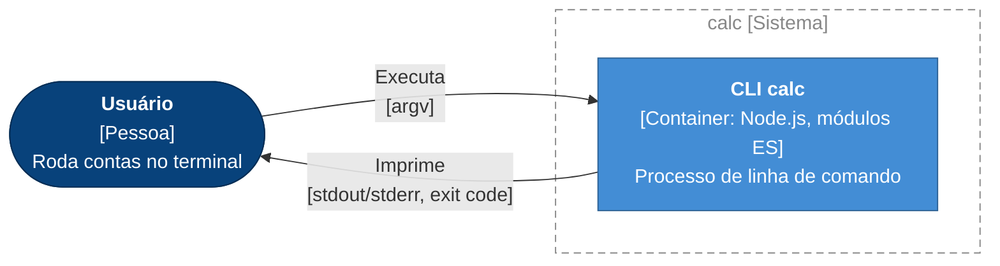
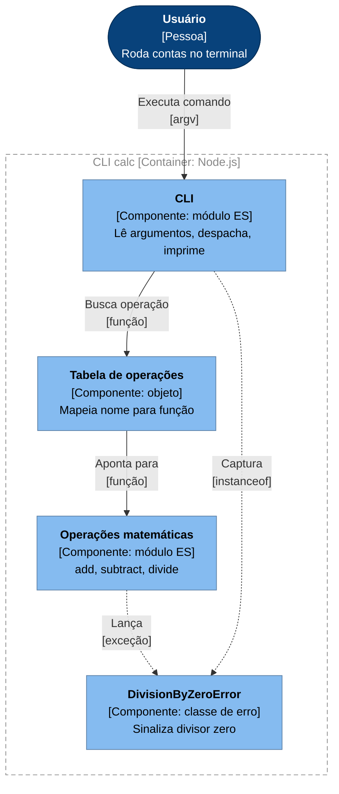
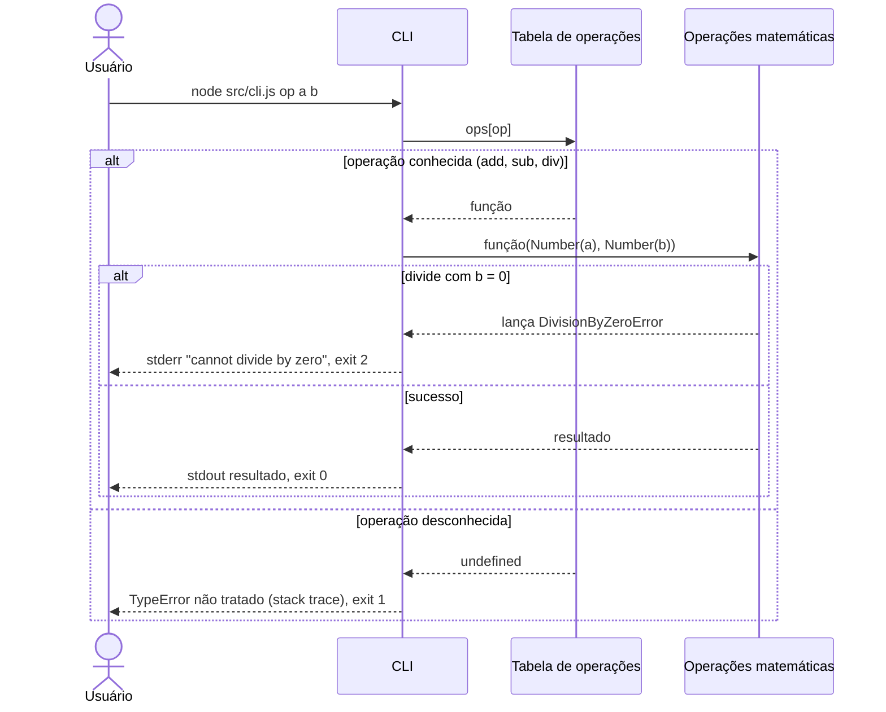
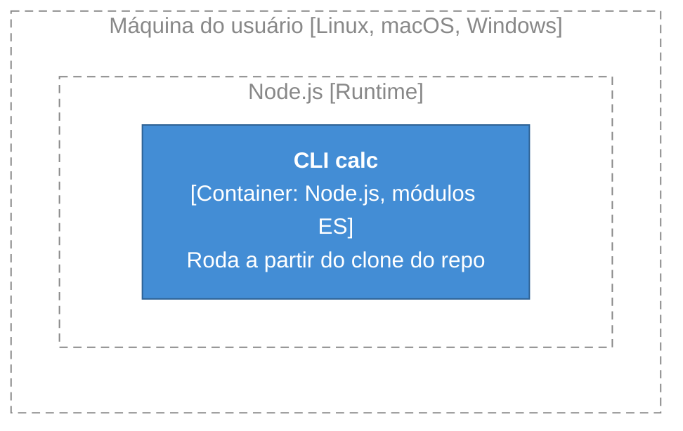

# Arquitetura de calc

> Documento vivo no padrão arc42, com diagramas C4. Atualizado a cada entrega pelo as-built.
> Última atualização: math-ops (2026-10-08).

## 1. Introdução e objetivos

### Visão geral dos requisitos

`calc` é uma calculadora de linha de comando em Node.js. Ela recebe uma operação e dois números como argumentos e imprime o resultado no stdout.

Operações disponíveis: `add` (soma), `sub` (subtração), `div` (divisão, com recusa de divisor zero).

Features entregues:

- [Operações matemáticas (math-ops)](features/math-ops.md): subtração, divisão e erro de divisão por zero.

### Metas de qualidade

| Meta | Motivo |
| :- | :- |
| Corretude | Uma calculadora que erra a conta não serve para nada. |
| Simplicidade | Projeto mínimo, sem dependências. O código precisa continuar legível de uma vez só. |
| Erros explícitos | Casos inválidos, como a divisão por zero, devem falhar com mensagem e código de saída, não com um valor enganoso como `Infinity`. |

### Stakeholders

| Papel | Expectativa |
| :- | :- |
| Usuário da CLI | Resultado correto no stdout, erro claro no stderr. |
| Desenvolvedor | Adicionar uma operação = uma função em `math.js` + uma entrada na tabela da CLI. |

## 2. Restrições

- Node.js com módulos ES (`"type": "module"` no `package.json`).
- Sem dependências de runtime nem de desenvolvimento.
- Testes com o runner nativo `node:test` (`npm test`).
- Interface exclusivamente por argumentos de linha de comando, stdout, stderr e código de saída.

## 3. Contexto e escopo

### Contexto de negócio

Legenda: azul-escuro = pessoa · azul = sistema

| Parceiro | O que troca com o sistema |
| :- | :- |
| Usuário | Envia operação e dois operandos. Recebe o resultado, ou uma mensagem de erro e um código de saída diferente de zero. |

Não há sistemas externos.

### Contexto técnico

| Canal | Uso |
| :- | :- |
| `argv` | `node src/cli.js <op> <a> <b>` |
| stdout | Resultado numérico. |
| stderr | Mensagem de erro (`cannot divide by zero`). |
| Código de saída | `0` sucesso · `2` divisão por zero · `1` erro não tratado (ex.: operação desconhecida). |

## 4. Estratégia de solução

- Um único processo Node.js, sem dependências.
- Duas camadas: a **CLI** cuida de entrada e saída; as **operações matemáticas** são funções puras, testáveis sem processo.
- A CLI despacha por uma **tabela de operações** (nome → função), então uma operação nova não mexe no fluxo de controle.
- Casos inválidos são sinalizados por **erros de domínio** (`DivisionByZeroError`) lançados pelas funções puras e traduzidos pela CLI em mensagem e código de saída.

## 5. Visão de blocos de construção

### Nível 1: containers

Legenda: azul-escuro = pessoa · azul = container · tracejado = fronteira

| Container | Responsabilidade | Tecnologia |
| :- | :- | :- |
| CLI calc | Ler argumentos, calcular, imprimir o resultado ou o erro | Node.js, módulos ES |

### Nível 2: componentes da CLI calc

Legenda: azul-escuro = pessoa · azul-claro = componente · tracejado = fronteira

| Componente | Responsabilidade | Interface pública |
| :- | :- | :- |
| CLI (`src/cli.js`) | Lê `argv`, converte operandos com `Number`, despacha, imprime e define o código de saída | Linha de comando: `<op> <a> <b>` |
| Tabela de operações | Mapeia `add`, `sub`, `div` para funções | Interna à CLI |
| Operações matemáticas (`src/math.js`) | Aritmética pura | `add(a, b)`, `subtract(a, b)`, `divide(a, b)` |
| `DivisionByZeroError` (`src/math.js`) | Erro de domínio para divisor zero | `class DivisionByZeroError extends Error` |

## 6. Visão de tempo de execução

### Executar uma operação

## 7. Visão de implantação

Legenda: azul = container · tracejado = nó de implantação

O repositório não tem build, empacotamento, `bin` no `package.json` nem CI. A execução é direta a partir do código-fonte (`node src/cli.js ...`). A versão mínima de Node.js não está declarada; o código usa módulos ES e `node:test`, ambos presentes nas versões atuais.

## 8. Conceitos transversais

**Tratamento de erros.** As funções puras lançam erros de domínio (`DivisionByZeroError`). A CLI captura só os erros que conhece, escreve a mensagem no stderr e sai com código específico (`2`). Qualquer outro erro é relançado e encerra o processo com stack trace e código `1`.

**Validação de entrada.** Não existe. Os operandos passam por `Number(...)`; valores inválidos ou ausentes viram `NaN`. O nome da operação não é validado (ver §11).

**Estratégia de testes.** Testes unitários das funções de `src/math.js` em `test/`, com `node:test` e `node:assert`. A CLI não é testada.

## 9. Decisões de arquitetura

Não há ADRs no repositório. Decisões relevantes, sem ADR:

- **Despacho por tabela de operações** (math-ops, sem ADR): a CLI mapeia nome → função em vez de encadear `if`s.
- **Erro de domínio para divisão por zero** (math-ops, sem ADR): `divide` lança `DivisionByZeroError` em vez de devolver `Infinity`; a CLI traduz para exit 2.

## 10. Requisitos de qualidade

| Meta | Estímulo | Resposta esperada |
| :- | :- | :- |
| Corretude | `node src/cli.js sub 5 3` | Imprime `2`, exit 0. |
| Corretude | `node src/cli.js div 6 3` | Imprime `2`, exit 0. |
| Erros explícitos | `node src/cli.js div 1 0` | stderr `cannot divide by zero`, exit 2, nada no stdout. |
| Simplicidade | Adicionar uma operação nova | Uma função em `math.js` e uma entrada na tabela da CLI. |

## 11. Riscos e débitos técnicos

| Item | Tipo (risco/débito) | Impacto | Origem |
| :- | :- | :- | :- |
| Operação desconhecida gera `TypeError` com stack trace e exit 1; antes saía em silêncio com exit 0 | Débito | Mensagem ruim ao usuário; mudança de comportamento não declarada | [math-ops](features/math-ops.md) |
| Operandos inválidos ou ausentes viram `NaN` sem aviso | Débito | Resultado sem sentido impresso como se fosse válido | [math-ops](features/math-ops.md) |
| CLI sem testes (despacho, códigos de saída, mensagens) | Débito | Regressões na interface passam despercebidas | [math-ops](features/math-ops.md) |
| `add` sem teste | Débito | Baixo, mas é a única operação sem cobertura | [math-ops](features/math-ops.md) |
| Divisor `NaN` não é recusado por `divide` | Risco | Imprime `NaN` em vez de erro | [math-ops](features/math-ops.md) |

## 12. Glossário

Não há `GLOSSARY.md` no repositório.

| Termo | Significado |
| :- | :- |
| Operação | Nome passado como primeiro argumento (`add`, `sub`, `div`) que escolhe a função a aplicar. |
| Operando | Cada um dos dois números passados depois da operação. |
| Tabela de operações | Objeto da CLI que liga o nome da operação à função de `math.js`. |
| `DivisionByZeroError` | Erro lançado por `divide` quando o divisor é zero. |
