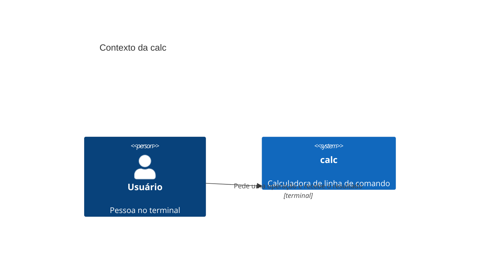
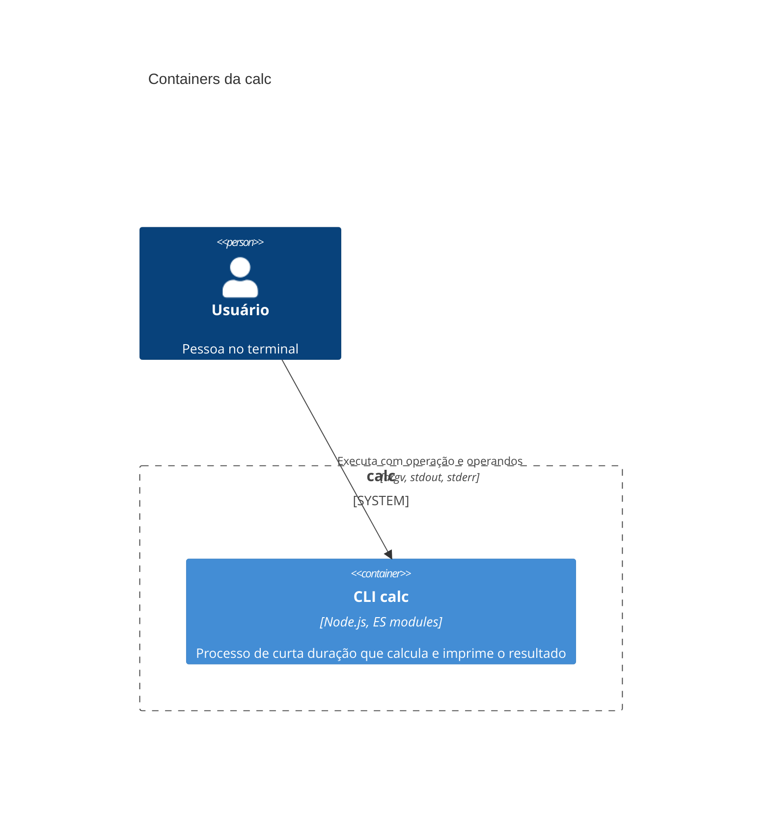
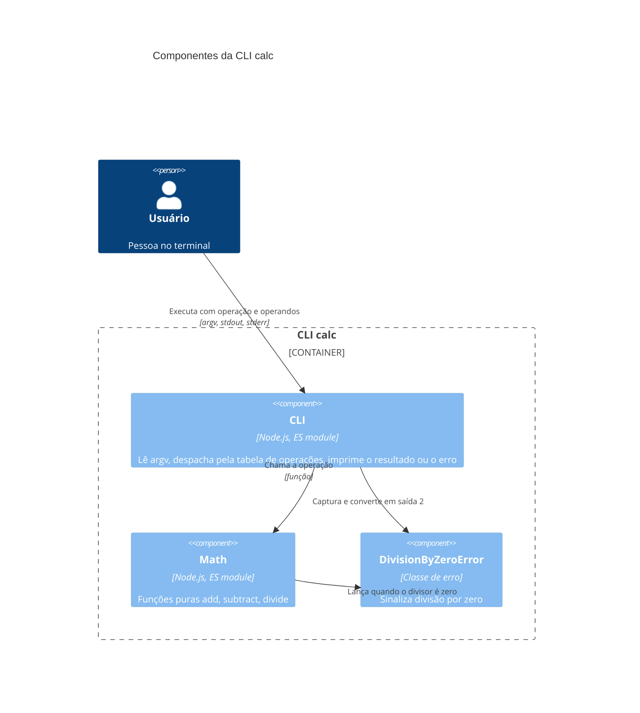
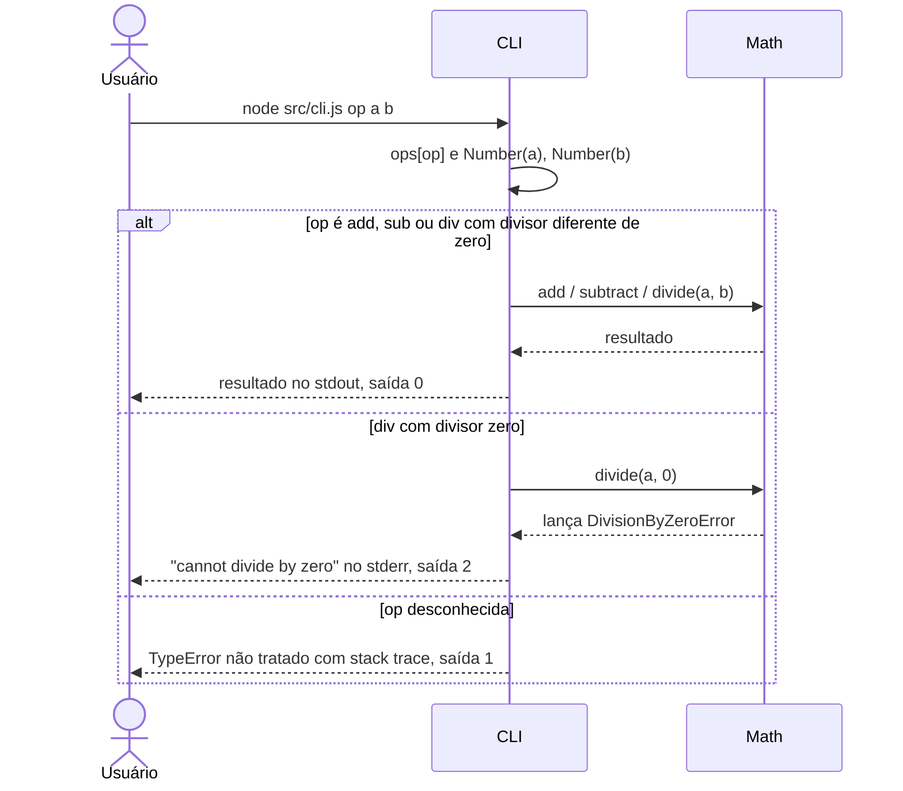
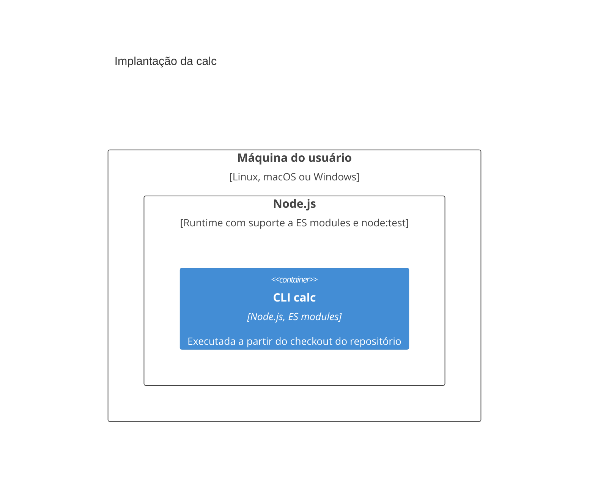

# Arquitetura de calc

> Documento vivo no padrão arc42, com diagramas C4. Atualizado a cada entrega pelo as-built.
> Última atualização: math-ops (2026-10-08).

## 1. Introdução e objetivos

### Visão geral dos requisitos

`calc` é uma calculadora de linha de comando em Node.js. Recebe uma operação e dois operandos como argumentos e imprime o resultado no stdout.

Features entregues:

- [Operações matemáticas (math-ops)](features/math-ops.md): `add`, `sub` e `div`, com recusa explícita de divisão por zero.

### Metas de qualidade

| Meta | Motivo |
| :- | :- |
| Corretude | Uma calculadora que erra a conta não tem utilidade. |
| Simplicidade | O sistema é pequeno; cada operação nova deve custar uma função e uma entrada na tabela. |
| Erros claros | Entradas inválidas, como divisão por zero, devem gerar mensagem e código de saída, não valores enganosos. |

### Stakeholders

| Papel | Expectativa |
| :- | :- |
| Usuário da CLI | Resultado correto no stdout e erros legíveis no stderr. |
| Desenvolvedor | Adicionar operações sem mexer no fluxo da CLI, com o núcleo testável isoladamente. |

## 2. Restrições

- Node.js com ES modules (`"type": "module"` no `package.json`).
- Sem dependências de runtime nem de desenvolvimento.
- Testes com o runner nativo `node:test`, via `npm test`.
- Sem entrada `bin` no `package.json`: a CLI roda com `node src/cli.js`.

## 3. Contexto e escopo

### Contexto de negócio

| Parceiro | O que troca com o sistema |
| :- | :- |
| Usuário | Envia operação e operandos; recebe resultado ou mensagem de erro. |

Não há sistemas externos.

### Contexto técnico

| Parceiro | Canal |
| :- | :- |
| Usuário | Argumentos de linha de comando (`argv`), stdout para o resultado, stderr e código de saída para erros. |

## 4. Estratégia de solução

- Um único processo Node.js, sem dependências.
- Separação entre núcleo e borda: o módulo Math tem funções puras e erros de domínio; a CLI faz o parse de `argv`, o despacho e a tradução de erros em código de saída.
- Despacho por tabela (`ops`): uma operação nova é uma função em Math e uma entrada na tabela.
- Corretude garantida por testes unitários no núcleo puro.

## 5. Visão de blocos de construção

### Nível 1: containers

| Container | Responsabilidade | Tecnologia |
| :- | :- | :- |
| CLI calc | Ler a operação, calcular e imprimir o resultado ou o erro | Node.js, ES modules |

### Nível 2: componentes da CLI calc

| Componente | Responsabilidade | Interface pública |
| :- | :- | :- |
| CLI | Parse de `argv`, despacho pela tabela `ops`, saída e códigos de erro | `node src/cli.js <add\|sub\|div> <a> <b>` |
| Math | Aritmética pura | `add(a, b)`, `subtract(a, b)`, `divide(a, b)` |
| DivisionByZeroError | Erro de domínio | Subclasse de `Error`, mensagem `cannot divide by zero` |

## 6. Visão de tempo de execução

### Executar uma operação

Introduzido por [math-ops](features/math-ops.md).

## 7. Visão de implantação

Não há build, empacotamento, publicação nem CI configurados no repositório. A execução a partir de um checkout local é inferida da ausência de `bin` e de configuração de release.

## 8. Conceitos transversais

**Tratamento de erros.** Erros de domínio são classes próprias lançadas pelo núcleo (`DivisionByZeroError`). A CLI captura só os erros conhecidos, escreve a mensagem no stderr e sai com código `2`; qualquer outro erro é relançado e encerra o processo com stack trace.

**Validação de entrada.** Mínima: os operandos passam por `Number()` sem verificação, e a operação não é validada contra a tabela. Ver §11.

**Estratégia de testes.** Testes unitários do núcleo puro com `node:test` em `test/`, rodados por `npm test`. A CLI não tem testes.

## 9. Decisões de arquitetura

Não há ADRs no repositório. Decisões relevantes sem ADR:

- **Erro de domínio tipado para divisão por zero** (sem ADR): o núcleo lança `DivisionByZeroError` em vez de devolver `Infinity`, e a CLI o mapeia para o código de saída `2`. Origem: [math-ops](features/math-ops.md).
- **Despacho por tabela na CLI** (sem ADR): operações ficam em um objeto `ops` indexado pelo nome. Origem: [math-ops](features/math-ops.md).

## 10. Requisitos de qualidade

| Meta | Estímulo | Resposta esperada |
| :- | :- | :- |
| Corretude | `node src/cli.js sub 5 3` | Imprime `2`, saída `0`. |
| Corretude | `node src/cli.js div 6 3` | Imprime `2`, saída `0`. |
| Erros claros | `node src/cli.js div 1 0` | `cannot divide by zero` no stderr, saída `2`. |
| Simplicidade | Adicionar uma operação nova | Uma função em Math, uma entrada em `ops` e um teste; nenhuma outra mudança na CLI. |

## 11. Riscos e débitos técnicos

| Item | Tipo (risco/débito) | Impacto | Origem |
| :- | :- | :- | :- |
| Operação desconhecida ou ausente gera `TypeError` com stack trace, sem mensagem de uso | Débito | Experiência ruim e código de saída genérico `1` | [math-ops](features/math-ops.md) |
| `ops` é objeto literal: nomes herdados de `Object.prototype` (`constructor`, `toString`) passam pelo despacho | Risco | Saída sem sentido em vez de erro | [math-ops](features/math-ops.md) |
| Operandos não numéricos viram `NaN` e saem com código `0` | Débito | Resultado enganoso tratado como sucesso | [math-ops](features/math-ops.md) |
| CLI sem testes (despacho e código de saída `2`); `add` sem teste | Débito | Regressões na borda passam despercebidas | [math-ops](features/math-ops.md) |

## 12. Glossário

Não há `GLOSSARY.md` no repositório.

| Termo | Significado |
| :- | :- |
| Operação | Nome passado como primeiro argumento da CLI: `add`, `sub` ou `div`. |
| Operandos | Os dois números passados após a operação. |
| Tabela de operações | Objeto `ops` da CLI que mapeia o nome da operação para a função de Math. |
| DivisionByZeroError | Erro de domínio lançado por `divide` quando o divisor é zero. |
