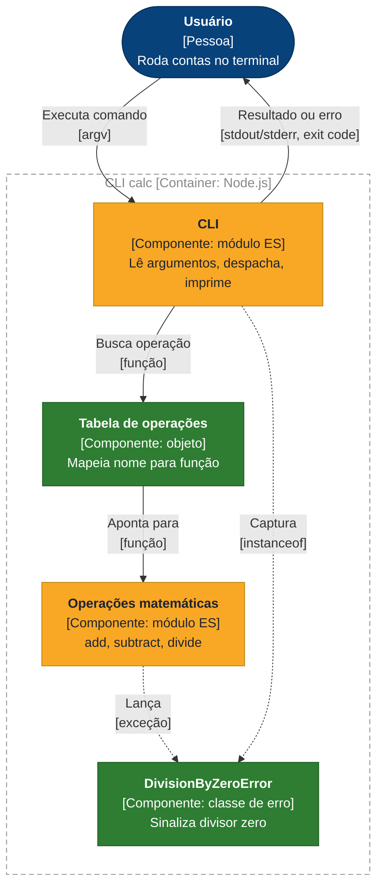
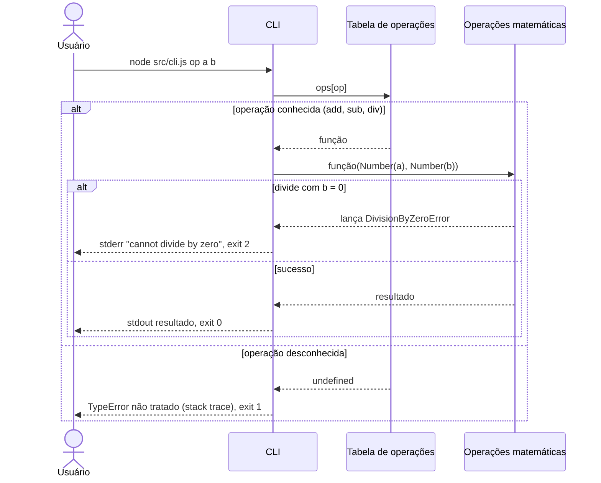

# Operações matemáticas (math-ops)

A calculadora de linha de comando, que antes só somava, agora também subtrai e divide. A divisão por zero é recusada com uma mensagem no stderr e código de saída 2, em vez de imprimir `Infinity`.

**Status:** entregue em `okeanos/math-ops` · **Spec:** nenhuma · **ADRs:** nenhum

## O que foi construído

- Nova operação `sub`: `node src/cli.js sub 5 3` imprime `2`.
- Nova operação `div`: `node src/cli.js div 6 3` imprime `2`.
- Divisão por zero: `div` com divisor `0` escreve `cannot divide by zero` no stderr e encerra com código 2.
- A CLI deixou de comparar o nome da operação com `if` e passou a consultar uma tabela de operações (`add`, `sub`, `div`).
- Mudança de comportamento não declarada: antes, uma operação desconhecida não imprimia nada e saía com código 0. Agora ela gera um `TypeError` não tratado (stack trace, código 1). Ver [Limites e próximos passos](#limites-e-próximos-passos).

Não havia spec nem tickets para esta feature. Este doc descreve o código do commit `ec1e6db`.

## Onde se encaixa na arquitetura

Legenda: azul-escuro = pessoa · azul-claro = componente · tracejado = fronteira · verde = novo · amarelo = alterado

## Como funciona

## Componentes

| Componente | Responsabilidade | Mudança |
| :- | :- | :- |
| CLI (`src/cli.js`) | Lê `argv`, converte os operandos com `Number`, despacha pela tabela, imprime o resultado e traduz `DivisionByZeroError` em exit 2 | Alterado: `if` trocado por tabela e `try/catch` |
| Tabela de operações | Mapeia `add`, `sub`, `div` para as funções de `math.js` | Novo |
| Operações matemáticas (`src/math.js`) | Funções puras `add`, `subtract`, `divide` | Alterado: `subtract` e `divide` adicionadas |
| `DivisionByZeroError` | Erro de domínio lançado por `divide` quando o divisor é `0` | Novo |

## Testes

- Seam testada: as funções de `src/math.js`, chamadas diretamente (`subtract`, `divide` e o caso `divide(1, 0)` lançando `DivisionByZeroError`).
- Os testes ficam em `test/` e usam o runner nativo `node:test`.
- Rodar: `npm test`.
- Sem cobertura: `add` e a própria CLI (despacho, códigos de saída, mensagens).
- Os testes não foram executados durante a geração deste doc: o ambiente bloqueou a execução de `node`.

## Limites e próximos passos

- **Operação desconhecida quebra a CLI.** `ops[op]` devolve `undefined` e a chamada gera `TypeError` com stack trace. Antes da feature ela saía em silêncio com código 0. Falta uma mensagem de uso.
- **Operandos inválidos viram `NaN`.** `Number("x")` e argumentos ausentes produzem `NaN` sem aviso.
- **A CLI não tem testes.** Os códigos de saída e o tratamento de `DivisionByZeroError` não estão testados.
- **`add` não tem teste.**
- **Só o zero exato é recusado.** `divide` compara com `b === 0`. `-0` também é recusado (`-0 === 0`), mas um divisor `NaN` passa e o resultado é `NaN`.

## Impacto na arquitetura

Primeira versão de [`docs/architecture.md`](../architecture.md), criada por esta feature. Seções com conteúdo desta feature: [§1](../architecture.md#1-introdução-e-objetivos), [§5](../architecture.md#5-visão-de-blocos-de-construção), [§6](../architecture.md#6-visão-de-tempo-de-execução), [§8](../architecture.md#8-conceitos-transversais), [§9](../architecture.md#9-decisões-de-arquitetura), [§11](../architecture.md#11-riscos-e-débitos-técnicos).
