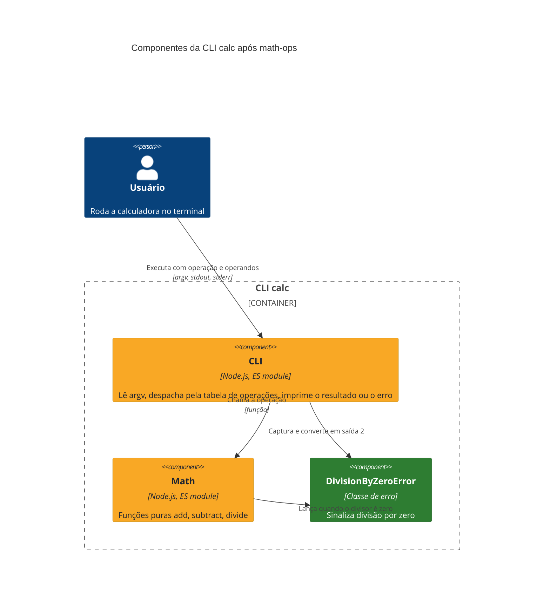
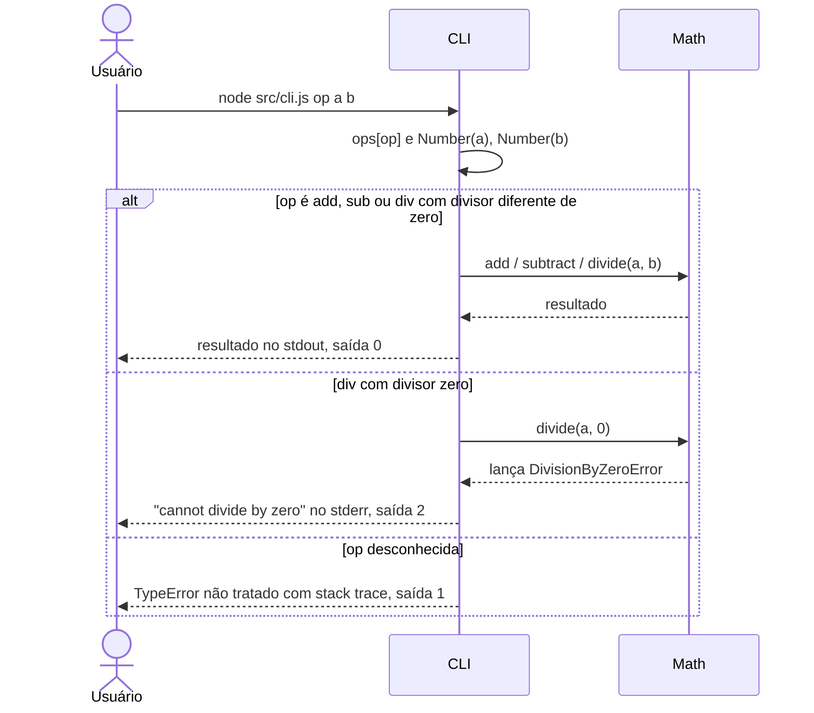

# Operações matemáticas (math-ops)

A calculadora de linha de comando, que antes só somava, agora também subtrai e divide. Divisão por zero é recusada com uma mensagem no stderr e código de saída `2`, em vez de imprimir `Infinity`.

**Status:** entregue em `okeanos/math-ops` · **Spec:** nenhuma · **ADRs:** nenhum

## O que foi construído

- `node src/cli.js sub <a> <b>` imprime `a - b`.
- `node src/cli.js div <a> <b>` imprime `a / b`.
- `node src/cli.js div <a> 0` escreve `cannot divide by zero` no stderr e sai com código `2`.
- `add` continua funcionando como antes.
- A CLI passou a despachar operações por uma tabela (`add`, `sub`, `div`) em vez de um `if` por operação.
- O núcleo `math` exporta `subtract`, `divide` e o erro de domínio `DivisionByZeroError`.

Sem spec registrada, não há desvios a apontar.

## Onde se encaixa na arquitetura

Verde = elemento novo; amarelo = elemento alterado.

## Como funciona

## Componentes

| Componente | Responsabilidade | Mudança |
| :- | :- | :- |
| CLI (`src/cli.js`) | Lê `argv`, escolhe a operação, imprime resultado, traduz `DivisionByZeroError` em saída `2` | Alterado: tabela de operações e tratamento de erro |
| Math (`src/math.js`) | Funções aritméticas puras | Alterado: `subtract` e `divide` |
| DivisionByZeroError | Erro de domínio da divisão por zero | Novo |

## Testes

Seam testada: as funções puras do módulo Math, com `node:test`, em `test/`. Cobertura: `subtract`, `divide` e o lançamento de `DivisionByZeroError`. Rode com `npm test`.

A CLI não tem teste: o mapeamento de `DivisionByZeroError` para saída `2` e o despacho pela tabela não são verificados automaticamente. `add` também não tem teste.

## Limites e próximos passos

- **Operação desconhecida derruba a CLI.** `ops[op]` é `undefined` para qualquer operação fora da tabela (inclusive a ausência de argumentos), e a chamada lança `TypeError` com stack trace, sem mensagem de uso.
- **Chaves herdadas de `Object.prototype` passam pela tabela.** `ops` é um objeto literal, então operações como `constructor` ou `toString` resolvem para funções herdadas e produzem saída sem sentido em vez de erro.
- **Operandos não numéricos viram `NaN`.** `Number("x")` não é validado; a CLI imprime `NaN` com saída `0`.
- **Sem teste da CLI.** O contrato de saída (stdout, stderr, código `2`) não tem teste.

Os mesmos itens estão na [seção 11 do architecture.md](../architecture.md#11-riscos-e-débitos-técnicos).

## Impacto na arquitetura

Primeira execução do as-built neste repositório: o [architecture.md](../architecture.md) foi criado, e esta feature aparece em [§1](../architecture.md#1-introdução-e-objetivos), [§5](../architecture.md#5-visão-de-blocos-de-construção), [§6](../architecture.md#6-visão-de-tempo-de-execução), [§8](../architecture.md#8-conceitos-transversais) e [§11](../architecture.md#11-riscos-e-débitos-técnicos).
