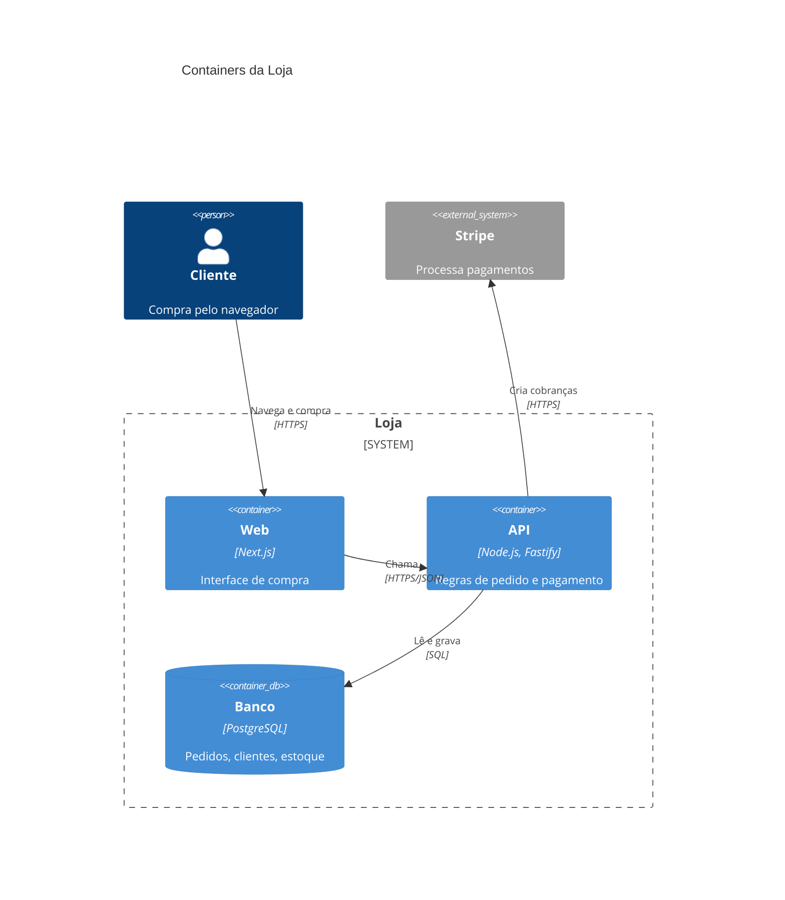

# As-built

Write the docs for what was **actually built**, from the code and the diff, not from the plan. The spec says what was intended; this says what exists. Two outputs, both Markdown with Mermaid (GitHub renders them), both committed with the code:

- **Architecture doc**: `docs/architecture.md`, the living architecture of the whole system, structured as **arc42** and drawn with the **C4 model**. Created on first run, updated in place after that.
- **Feature doc**: `docs/features/<feature-slug>.md`, what this feature built and how it fits into the architecture.

Write in the language of the repo's existing docs. With no docs yet, use the language the user speaks in the session. The templates below use Portuguese headings; translate them when the doc language differs.

If the repo already keeps docs somewhere else (a docs site, `documentation/`, a layout recorded in `CLAUDE.md`), follow that convention and keep the same two roles.

## 1. Gather the facts

- The diff since the branch point: `git diff $(git merge-base HEAD <base>)...HEAD`, where `<base>` is the branch the work was cut from.
- The spec and tickets under `.scratch/<feature>/`, if any, and the AFK report if the build ran AFK.
- ADRs (`docs/adr/`) and `GLOSSARY.md`. Name everything in the glossary's vocabulary.
- The existing `docs/architecture.md`, if there is one.
- For a first run, the whole system: entry points, deployable units, dependencies (`package.json`, `Dockerfile`, compose files, CI, infra config), external services (env vars and SDK clients reveal them), and data stores.

Read the code itself wherever a diagram needs to show how pieces connect. When the spec and the code disagree, the code wins, and the doc notes the deviation. Never draw an element you didn't find in the code or config; when something is inferred (a deployment target nobody configured in the repo), say so in the text.

## 2. The C4 diagrams

Use Mermaid's native C4 syntax. Each level answers a different question:

| Level | Mermaid | Question it answers | Where |
| :- | :- | :- | :- |
| 1 · Context | `C4Context` | Who uses the system, and which external systems does it talk to? | arc42 §3 |
| 2 · Container | `C4Container` | Which deployable or runnable units make up the system (apps, CLIs, services, databases, queues), and how do they communicate? | arc42 §5 |
| 3 · Component | `C4Component` | Inside one container, which modules exist and how do they depend on each other? One diagram per container worth opening. | arc42 §5, feature doc |
| Dynamic | `C4Dynamic` or `sequenceDiagram` | How does a key flow move through the components at runtime? Use `sequenceDiagram` when the flow has branches or error paths; C4Dynamic has no alternatives. | arc42 §6, feature doc |
| Deployment | `C4Deployment` | Where does each container run? | arc42 §7 |

Plus, when they apply: `erDiagram` for persisted data, `stateDiagram-v2` for an explicit state machine.

Rules for every C4 diagram:

- Give every element a description and a technology where one exists: `Container(api, "API", "Node.js, Fastify", "Serves the REST API")`.
- Every relationship has a verb label and, across containers, the protocol: `Rel(web, api, "Lê e grava pedidos", "HTTPS/JSON")`.
- Group with boundaries: `System_Boundary`, `Container_Boundary`, `Deployment_Node`.
- Keep each diagram under ~15 elements; split by container or flow rather than cram.
- Label with module, container, or concept names, never file paths.
- In feature docs, highlight what this feature added or changed with `UpdateElementStyle`: new elements `$bgColor="#2e7d32", $fontColor="#ffffff", $borderColor="#1b5e20"`, changed elements `$bgColor="#f9a825", $fontColor="#1d2330", $borderColor="#b8860b"`. Say in the text which color means what.
- Add `UpdateLayoutConfig($c4ShapeInRow="3", $c4BoundaryInRow="1")` when the default layout crowds.
- Keep relationship labels short (two to four words); Mermaid's C4 layout draws them at the midpoint of the line and they often land on top of a box. Move a label that overlaps with `UpdateRelStyle(from, to, $offsetX="-40", $offsetY="-50")`.

Example (Container level):



### Mermaid syntax rules

- Strings in C4 macros are double-quoted; never put a double quote inside one.
- Element aliases are plain identifiers (`authService`).
- Outside C4: quote labels with spaces or punctuation (`A["Auth service"]`), no HTML in labels except `<br/>`.
- If `mmdc` (mermaid-cli) is available, render every diagram once to check it parses, and look at the C4 ones for labels sitting on boxes. Don't install it just for this.

## 3. The architecture doc (arc42)

`docs/architecture.md` follows the twelve arc42 sections, in order. Keep every heading. A section that doesn't apply yet says so in one line with the reason (`Não se aplica: sem dados persistidos.`); arc42's fixed structure is what lets a reader find things. Size each section to the system: a CLI gets a paragraph where a platform gets pages.

```markdown
# Arquitetura de <sistema>

> Documento vivo no padrão arc42, com diagramas C4. Atualizado a cada entrega pelo as-built.
> Última atualização: <feature> (<data>).

## 1. Introdução e objetivos
### Visão geral dos requisitos
<O que o sistema faz, em poucas linhas. Liste as features entregues com link para o doc de cada uma.>
### Metas de qualidade
<As 3 a 5 qualidades que mais pesam (ex.: corretude, simplicidade, desempenho), cada uma com uma linha de motivo.>
### Stakeholders
| Papel | Expectativa |

## 2. Restrições
<Técnicas (linguagem, runtime, plataforma), organizacionais e convenções. Só o que o código e a config mostram ou o usuário disse.>

## 3. Contexto e escopo
### Contexto de negócio
<C4Context: pessoas e sistemas externos. Tabela: parceiro → o que troca com o sistema.>
### Contexto técnico
<Canais e protocolos com cada parceiro (HTTPS, CLI/stdin/stdout, fila, arquivo).>

## 4. Estratégia de solução
<As decisões fundamentais em poucas linhas: tecnologia, decomposição de alto nível, como as metas de qualidade são atingidas.>

## 5. Visão de blocos de construção
### Nível 1: containers
<C4Container + tabela: container → responsabilidade → tecnologia.>
### Nível 2: componentes de <container>
<Um C4Component por container relevante + tabela: componente → responsabilidade → interface pública.>

## 6. Visão de tempo de execução
<Um subtítulo por fluxo importante, cada um com C4Dynamic ou sequenceDiagram, incluindo os caminhos de erro relevantes.>

## 7. Visão de implantação
<C4Deployment: onde cada container roda (máquina do usuário, container Docker, nuvem). Como build e release acontecem, se o repo mostra.>

## 8. Conceitos transversais
<Tratamento de erros, validação de entrada, logging, configuração, estratégia de testes, segurança. Um parágrafo curto por conceito que de fato existe no código.>

## 9. Decisões de arquitetura
<Lista de ADRs com link e uma linha cada. Decisões relevantes sem ADR também, marcadas como tal.>

## 10. Requisitos de qualidade
<Cenários concretos e testáveis para cada meta da seção 1: estímulo → resposta esperada.>

## 11. Riscos e débitos técnicos
| Item | Tipo (risco/débito) | Impacto | Origem |
<Inclua os achados dos docs de feature. Remova os que foram resolvidos.>

## 12. Glossário
<Termos do domínio. Se existe GLOSSARY.md, aponte para ele e liste só os termos usados aqui.>
```

**Updating an existing doc**: change only what this feature affected. Add or change elements in the C4 diagrams, add the feature's flows to §6, its decisions to §9, its findings to §11, and the "Última atualização" line. Never rewrite unrelated sections. When the feature changed nothing at some level (no new containers), leave that diagram alone.

## 4. The feature doc

`docs/features/<feature-slug>.md`:

```markdown
# <Nome da feature>

<Duas ou três frases: o que o usuário consegue fazer agora que antes não conseguia.>

**Status:** entregue em `<branch>` · **Spec:** <link ou "nenhuma"> · **ADRs:** <links ou "nenhum">

## O que foi construído
<Comportamento visível ao usuário, em lista curta. Desvios da spec e o motivo.>

## Onde se encaixa na arquitetura
<C4Component do container afetado, com elementos novos e alterados destacados. Uma linha dizendo qual cor é o quê.>

## Como funciona
<Um sequenceDiagram ou C4Dynamic por fluxo novo ou alterado, com o caminho de erro quando faz parte do comportamento.>

## Componentes
| Componente | Responsabilidade | Mudança |

## Dados
<erDiagram e migrações. Omita a seção se nada persistido mudou.>

## Testes
<Quais seams são testadas, onde os testes ficam (nível de diretório) e como rodar.>

## Limites e próximos passos
<Lacunas, itens fora de escopo, tickets de continuação. Os mesmos itens entram na seção 11 do architecture.md.>

## Impacto na arquitetura
<Quais seções do architecture.md esta feature mudou, com link para cada uma.>
```

Omit any empty section except **O que foi construído**, **Onde se encaixa na arquitetura** and **Como funciona**.

## 5. Bug fixes

Bug flows don't create a feature doc. If the fix changed behaviour that a doc describes, update that doc, and add or remove the matching entry in arc42 §11. Otherwise do nothing.

## 6. Finish

Commit the docs on the work branch (`docs: as-built de <feature>`). In the G2 summary, link the feature doc and list the arc42 sections that changed.
