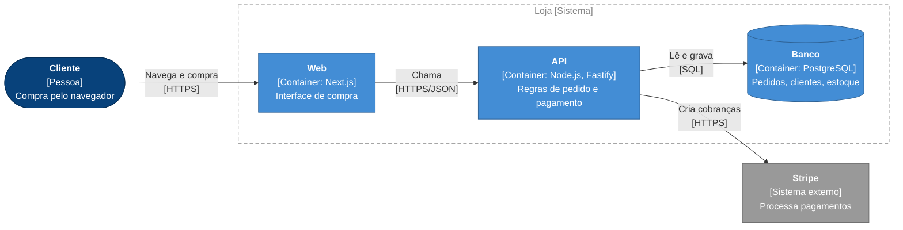

# As-built

This skill is expensive in tokens, so it never runs on its own initiative: the flow offers it after `okeanos-code-review` with a recommendation, and it runs only when the user says yes (or asks for it directly).

Write the docs for what was **actually built**, from the code and the diff, not from the plan. The spec says what was intended; this says what exists. Two outputs, both Markdown with Mermaid (GitHub renders them), both committed with the code:

- **Architecture doc**: `docs/architecture.md`, the living architecture of the whole system, structured as **arc42** and drawn with the **C4 model**. Created on first run, updated in place after that.
- **Feature doc**: `docs/features/<feature-slug>.md`, what this feature built and how it fits into the architecture.

Write in the language of the repo's existing docs. With no docs yet, use the language the user speaks in the session. The templates below use Portuguese headings; translate them when the doc language differs.

If the repo already keeps docs somewhere else (a docs site, `documentation/`, a layout recorded in `CLAUDE.md`), follow that convention and keep the same two roles.

## 1. Gather the facts

- The diff since the branch point: `git diff $(git merge-base HEAD <base>)...HEAD`, where `<base>` is the branch the work was cut from.
- The spec and tickets under `.scratch/<feature>/`, if any, and the AFK report if the build ran AFK.
- ADRs (`docs/adr/`) and `GLOSSARY.md`. Name everything in the glossary's vocabulary.
- The existing `docs/architecture.md`, if there is one.
- For a first run, the whole system: entry points, deployable units, dependencies (`package.json`, `Dockerfile`, compose files, CI, infra config), external services (env vars and SDK clients reveal them), and data stores.

Read the code itself wherever a diagram needs to show how pieces connect. When the spec and the code disagree, the code wins, and the doc notes the deviation. Never draw an element you didn't find in the code or config; when something is inferred (a deployment target nobody configured in the repo), say so in the text.

## 2. The C4 diagrams

Use the **C4 model's notation** (people, software systems, containers, components, boundaries, labelled relationships) and draw it with Mermaid `flowchart`. Do **not** use Mermaid's native `C4Context`/`C4Container`/`C4Component`/`C4Dynamic`/`C4Deployment` diagrams: their layout engine is experimental and puts labels on top of boxes. `flowchart` lays out cleanly and renders the same on GitHub.

| Level | Question it answers | Where |
| :- | :- | :- |
| 1 · Context | Who uses the system, and which external systems does it talk to? | arc42 §3 |
| 2 · Container | Which deployable or runnable units make up the system (apps, CLIs, services, databases, queues), and how do they communicate? | arc42 §5 |
| 3 · Component | Inside one container, which modules exist and how do they depend on each other? One diagram per container worth opening. | arc42 §5, feature doc |
| Runtime | How does a key flow move through the components? Use `sequenceDiagram`, with `alt` blocks for error paths. | arc42 §6, feature doc |
| Deployment | Where does each container run? Nested `subgraph`s as deployment nodes. | arc42 §7 |

Plus, when they apply: `erDiagram` for persisted data, `stateDiagram-v2` for an explicit state machine.

### The C4 flowchart template

Start every C4 diagram from this block. Keep the `init` line and the `classDef`s exactly as written so every diagram in every repo looks the same; include only the classes the diagram uses.



Shapes and labels:

- Person: stadium `id(["..."])`. Database or store: cylinder `id[("...")]`. Everything else: rectangle `id["..."]`.
- Every element label is `<b>Nome</b><br/>[Tipo: tecnologia]<br/>Descrição curta`. Type is Pessoa, Sistema, Sistema externo, Container or Componente. Descriptions stay under ~8 words; the details go in the table under the diagram.
- Every relationship label is `"Verbo curto<br/>[protocolo]"`: two to four words plus the protocol in brackets. Inside one container the protocol is the mechanism (`[função]`, `[evento]`).
- Use `-.->` for exceptional or asynchronous relationships (errors thrown, events, callbacks), `-->` for everything else.
- Boundaries are `subgraph id["Nome [Sistema]"]` (or `[Container: tecnologia]` at component level) followed by `class id boundary`. Deployment nodes are nested subgraphs: `subgraph maquina["Máquina do usuário [Linux, macOS, Windows]"]`.

Layout:

- `flowchart LR` when the longest chain of elements has 4 or fewer, so arrows enter boundaries from the side. With 5 or more, use `flowchart TB`: a wide LR diagram shrinks on GitHub until the text is unreadable.
- Keep each diagram under ~12 elements; split by container or flow rather than cram.
- Label with module, container, or concept names, never file paths.
- In feature docs, mark what this feature added with `:::new` and what it changed with `:::changed`. Untouched elements keep their C4 class.
- Right under every C4 diagram, one legend line: `Legenda: azul-escuro = pessoa · azul = container · azul-claro = componente · cinza = sistema externo · tracejado = fronteira`, plus `· verde = novo · amarelo = alterado` in feature docs. Translate to the doc's language.

### Mermaid syntax rules

- Node IDs are plain identifiers (`authService`); labels carry the readable name, always in double quotes.
- Never put a double quote inside a label. HTML in labels is limited to `<b>` and `<br/>`.
- If `mmdc` (mermaid-cli) is available, render every diagram once and look at the image: labels readable, nothing overlapping, arrows not crossing boundary titles. Don't install it just for this.

## 3. The architecture doc (arc42)

`docs/architecture.md` follows the twelve arc42 sections, in order. Keep every heading. A section that doesn't apply yet says so in one line with the reason (`Não se aplica: sem dados persistidos.`); arc42's fixed structure is what lets a reader find things. Size each section to the system: a CLI gets a paragraph where a platform gets pages.

```markdown
# Arquitetura de <sistema>

> Documento vivo no padrão arc42, com diagramas C4. Atualizado a cada entrega pelo as-built.
> Última atualização: <feature> (<data>).

## 1. Introdução e objetivos
### Visão geral dos requisitos
<O que o sistema faz, em poucas linhas. Liste as features entregues com link para o doc de cada uma.>
### Metas de qualidade
<As 3 a 5 qualidades que mais pesam (ex.: corretude, simplicidade, desempenho), cada uma com uma linha de motivo.>
### Stakeholders
| Papel | Expectativa |

## 2. Restrições
<Técnicas (linguagem, runtime, plataforma), organizacionais e convenções. Só o que o código e a config mostram ou o usuário disse.>

## 3. Contexto e escopo
### Contexto de negócio
<Diagrama C4 de contexto: pessoas e sistemas externos. Tabela: parceiro → o que troca com o sistema.>
### Contexto técnico
<Canais e protocolos com cada parceiro (HTTPS, CLI/stdin/stdout, fila, arquivo).>

## 4. Estratégia de solução
<As decisões fundamentais em poucas linhas: tecnologia, decomposição de alto nível, como as metas de qualidade são atingidas.>

## 5. Visão de blocos de construção
### Nível 1: containers
<Diagrama C4 de containers + tabela: container → responsabilidade → tecnologia.>
### Nível 2: componentes de <container>
<Um diagrama C4 de componentes por container relevante + tabela: componente → responsabilidade → interface pública.>

## 6. Visão de tempo de execução
<Um subtítulo por fluxo importante, cada um com um sequenceDiagram, incluindo os caminhos de erro relevantes.>

## 7. Visão de implantação
<Diagrama de implantação (subgraphs aninhados como nós): onde cada container roda (máquina do usuário, container Docker, nuvem). Como build e release acontecem, se o repo mostra.>

## 8. Conceitos transversais
<Tratamento de erros, validação de entrada, logging, configuração, estratégia de testes, segurança. Um parágrafo curto por conceito que de fato existe no código.>

## 9. Decisões de arquitetura
<Lista de ADRs com link e uma linha cada. Decisões relevantes sem ADR também, marcadas como tal.>

## 10. Requisitos de qualidade
<Cenários concretos e testáveis para cada meta da seção 1: estímulo → resposta esperada.>

## 11. Riscos e débitos técnicos
| Item | Tipo (risco/débito) | Impacto | Origem |
<Inclua os achados dos docs de feature. Remova os que foram resolvidos.>

## 12. Glossário
<Termos do domínio. Se existe GLOSSARY.md, aponte para ele e liste só os termos usados aqui.>
```

**Updating an existing doc**: change only what this feature affected. Add or change elements in the C4 diagrams (keeping the template's classes), add the feature's flows to §6, its decisions to §9, its findings to §11, and the "Última atualização" line. Never rewrite unrelated sections. When the feature changed nothing at some level (no new containers), leave that diagram alone.

## 4. The feature doc

`docs/features/<feature-slug>.md`:

```markdown
# <Nome da feature>

<Duas ou três frases: o que o usuário consegue fazer agora que antes não conseguia.>

**Status:** entregue em `<branch>` · **Spec:** <link ou "nenhuma"> · **ADRs:** <links ou "nenhum">

## O que foi construído
<Comportamento visível ao usuário, em lista curta. Desvios da spec e o motivo.>

## Onde se encaixa na arquitetura
<Diagrama C4 de componentes do container afetado, com `:::new` e `:::changed`, e a linha de legenda.>

## Como funciona
<Um sequenceDiagram por fluxo novo ou alterado, com o caminho de erro quando faz parte do comportamento.>

## Componentes
| Componente | Responsabilidade | Mudança |

## Dados
<erDiagram e migrações. Omita a seção se nada persistido mudou.>

## Testes
<Quais seams são testadas, onde os testes ficam (nível de diretório) e como rodar.>

## Limites e próximos passos
<Lacunas, itens fora de escopo, tickets de continuação. Os mesmos itens entram na seção 11 do architecture.md.>

## Impacto na arquitetura
<Quais seções do architecture.md esta feature mudou, com link para cada uma.>
```

Omit any empty section except **O que foi construído**, **Onde se encaixa na arquitetura** and **Como funciona**.

## 4b. Drift and the spec

**Doc drift.** List the paths this change touched and the modules they belong to. Search `docs/`, `docs/adr/`, `README*` and `CLAUDE.md` for mentions of those modules, functions, commands and file paths. Anything that now describes the old behaviour (a renamed module, a removed command, a flow that changed) gets fixed in the same commit. Anything you're unsure about goes into the G2 summary as "possível doc desatualizado: <arquivo>: <trecho>". An ADR whose decision this change contradicts is never edited silently: flag it to the user, since superseding an ADR is their call.

**The spec's fate.** Once the as-built docs exist, they describe what is; the spec described what was intended. Archive the spec instead of maintaining two sources: add at its top `> Implementada em <data>. O estado atual está em [docs/features/<slug>.md](...).` and leave it in `.scratch/<feature>/` as history. Never update an archived spec to match later changes.

## 5. Bug fixes

Bug flows don't create a feature doc. If the fix changed behaviour that a doc describes, update that doc, and add or remove the matching entry in arc42 §11. Otherwise do nothing.

## 6. Finish

Commit the docs on the work branch (`docs: as-built de <feature>`). In the G2 summary, link the feature doc and list the arc42 sections that changed.
